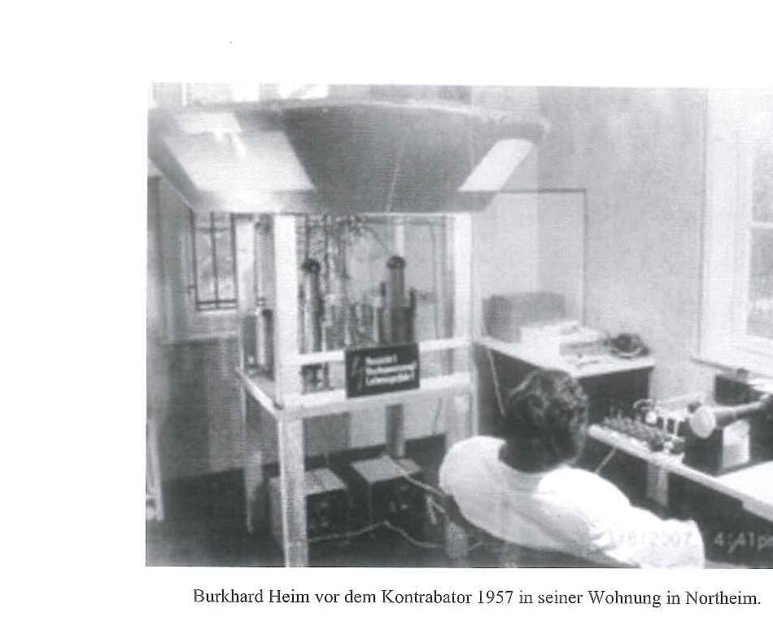

# Heim's Mass Formula — Inspected

*A reproducible investigation of Burkhard Heim's 1989 elementary-particle mass
formula: how does it work, where does its accuracy actually come from, and
how much of it is genuinely theory-driven?*

<p align="center">
  <br>
  <em>Burkhard Heim at his self-built Kontrabator apparatus, Northeim, 1957.<br>
  (From the IvL/IGAAP 2017 reconstruction; original photo from von Ludwiger 2010.)</em>
</p>

> 📖 **New to Heim theory?** Read **[THEORY_EXPLAINED.md](THEORY_EXPLAINED.md)**
> first — a 15-chapter, three-level (Beginner / Intermediate / Expert)
> walk-through of the framework: Burkhard Heim's biography, the 6D
> geometry, the metron, the mass formula step by step, a worked proton
> example, Syntrometrie, and the Extended (8D / 12D) Heim–Dröscher
> theory. The README that follows is the analysis report; the
> companion document is the conceptual guide.

---

## Table of contents

**Top of the report**
- [TL;DR](#tldr) — one-paragraph summary plus 11-item highlight list
- [Acknowledgements](#acknowledgements) — community contributors
- [Scope of this repository](#scope-of-this-repository) — what is and is not implemented
  - [Sector-by-sector source status](#sector-by-sector-source-status)
  - [Audit-priority order (recommended)](#audit-priority-order-recommended) — seven-step roadmap

**Results**
- [Headline findings](#headline-findings) — eight top-line results, including the two pre-registered tests
  - [Findings retracted or sharpened after the source audit](#findings-that-were-retracted-or-sharpened-after-the-source-audit)
- [Speculative summary](#speculative-summary) — subjective probability bet
- [Findings](#findings) — full per-test results
  - [Baseline accuracy](#baseline-accuracy)
  - [The "fitted" constants](#the-fitted-constants)
  - [Where the accuracy actually lives](#where-the-accuracy-actually-lives)
  - [Probing η's functional form](#probing-ηs-functional-form)
  - [The fine-structure constant](#the-fine-structure-constant)
  - [Choice of physical constants](#choice-of-physical-constants)
  - [Mass predictions](#mass-predictions)
  - [Post-1989 particle predictions](#post-1989-particle-predictions)
  - [Charge-doublet mass splittings](#charge-doublet-mass-splittings-new--extracted-from-g-tabelle-iv)
  - [Lifetime predictions](#lifetime-predictions)
  - [Beyond the mass formula — Kontrabarie](#beyond-the-mass-formula--kontrabarie)

**Reading the repository**
- [Background](#background) — 6D geometry, metrons, the mass formula in 60 seconds
- [Repository layout](#repository-layout) — file map
- [Quickstart](#quickstart) — build, run, test, reproduce
- [Methodology](#methodology) — how the analysis was conducted

**Verdict**
- [The honest verdict](#the-honest-verdict)
  - [Framework limits surfaced by the May 2026 manuscript audit](#framework-limits-surfaced-by-the-may-2026-manuscript-audit)
- [Comparative assessment — Heim vs. SM vs. String Theory](#comparative-assessment--heim-vs-standard-model-vs-string-theory)
  - [Subjective probability estimates](#subjective-probability-estimates)
- [Open questions](#open-questions) — including the Δ-family Open Q 1b
- [References](#references) — J-series manuscripts, A–H bundle, code chain, PDG/CODATA
- [License & attribution](#license--attribution)

---

## Acknowledgements

This investigation would not have been possible without the original
documents, code, and reference implementations preserved and shared by:

- **The Forschungskreis Heimsche Theorie / IGAAP e.V.** at
  [heim-theory.com](https://heim-theory.com/) — the curators of Burkhard
  Heim's mathematical legacy. They host the 1989 reformulation of the
  mass formula, the 81-page derivation manuscript, Heim's original
  papers (J0023, J0025, J0032, J0033), the multi-volume "Synmetronik
  der Welt" books, and — crucially — the working Excel
  implementation `Heim_1989_Massenformel_0.4.xlsm` that contains both
  the mass and lifetime calculations. The Excel reference is what
  ultimately allowed this Python port to find and correct two
  transcription bugs that had been in every public C/C# implementation
  since 2002–2006.
- **The Heim-Theory Discord** (linked from
  [heim-theory.com](https://heim-theory.com/)) — the active community
  of researchers, students and enthusiasts continuing Heim's work
  today. The community shared the complete document set, including the
  Excel spreadsheet that turned a mostly-broken first-pass lifetime
  port (5 / 18 within factor 3) into a near-complete one (17 / 18
  within factor 3, 15 to better than 12 %).

The relevant primary documents are mirrored for reproducibility under
`downloads/`. The Heim community works in an **open-science** spirit:
the documents and reference implementations are freely available for
use, modification, and redistribution. A citation back to
[heim-theory.com](https://heim-theory.com/) is appreciated — mainly
so other readers can find the original sources and the broader
ecosystem of Heim-theory work.

---

## TL;DR

Burkhard Heim (1925–2001) published a mass formula — developed
1973-1976 and refined into the 1982 Aik-matrix form, but most widely
circulated via the IGW-Innsbruck 2003 restatement labelled "1989" —
that claims to compute the rest masses of ~20 elementary particles
from a handful of integer quantum numbers, with no free fitting
parameters in the continuous sense. The internal self-consistency
to Heim's own Tabelle II is at the ≤ 2 eV level (8-decimal
agreement); against modern PDG values it is ~0.05–0.2 % RMS.
The pre-registered post-1989 / lattice-density tests of May 2026
sharpen this further: the ≤ 2 eV intra-Heim figure is *structural*
(the integer lattice is sparse at that precision), whereas the
~ 0.1 % PDG-comparison is partly slot-density-aided (the lattice
becomes dense at the 100 keV–1 MeV scale). Mainstream physics
does not accept the framework. This
repository:

1. Contains a runnable, annotated reference implementation (C and Python).
2. Reproduces Eli Gildish's 2006 C output **bit-for-bit** (via
   `formulae.LEGACY_B3_FORM = True`), and Heim's own Tabelle II to
   ≤ 2 eV across the well-behaved ground states under the canonical
   port's J0060-corrected [B3] form.
3. Maps every line of code to its corresponding equation in the IGW
   Innsbruck 2003 restatement ([B##] equation tags throughout). Note
   that "1989" in this context is an IGW-Innsbruck filename convention,
   not the actual date of the underlying calculation — Mazzone (2012)
   has dated the underlying scripts to 1973-1976; see Scope below.
4. Probes — by perturbing each ingredient — *which* parts of the formula are
   actually doing the work.
5. Finds and corrects three transcription bugs in the upstream C/C#
   code (and Python port) that had been there since 2002–2026, and
   **diagnoses a fourth (probable) typo in the published [B3] equation
   itself** — the `+4qα₋` charge term appears to be missing a `/α₊`
   factor.  With the proposed correction and Heim's 1989 constants,
   the port reproduces Heim Tabelle II to ~2 eV precision across 19 of
   21 ground states (the J0060 source documentation removes the need
   for community confirmation; the proposed correction now has a
   primary-manuscript anchor). A May 2026
   port-side bug in the k=2 baryon scan (wrong η argument order in
   `resonance_wscan_baryons.py`) jumped baryon K_B-exact reproductions
   from 120/145 → 144/145 once fixed.
6. **Reproduces G-Tabelle IV** (23 mesonic resonances at k=1) from
   Heim's J0032 exhaustion procedure: all 23 entries matched with
   exact K_B and Δ_M < 0.2 MeV, and the matched (n, m, p, σ) tuples
   lie sector-consistently on the Anregerkurve f(N) = a·N/(N+1) + b·N.
7. **Reproduces G-Tabellen V_{a,b,c}** (145 charge-state entries of
   the 76 baryonic resonances at k=2): 144/145 K_B-exact, 143/145
   within 2 MeV. Per-state Q (= 2·J) determined by *iterative*
   Anregerkurve-consistency — no PDG-J lookup required — driving all
   145 states into 18 physical sectors. **Anregerkurve coefficients
   (a, b) reproduced ab initio from J0032 eqs. 14a-14b₁**: the
   12-entry Λ z=0 branch shows b_fit = +0.0070 ≡ b_pred = +0.0070
   to 6 decimals, including the historically anomalous Λ(1405) and
   Λ(1690).
8. **Manuscript-anchored verification** of η, θ, α, Q_i, N_i and the
   21 ground-state W_{N=0} values against Heim's own Anhang B
   (J0032 pp.41-43). 24/24 (η, θ, α, Q, B, H, A) match exactly;
   26/29 N_i values agree to 7+ decimals; 20/21 W_{N=0} agree to
   10⁻⁴. The three flagged Anhang-B discrepancies (N_3(2,2),
   N_6(2,0), o⁰ W_{N=0}) trace to **typos within Heim's own
   Anhang B table** (e.g. Heim's o⁺⁺ and o⁻ a_1 rows appear
   swapped relative to the W column) — calc_a, calc_W, calc_n,
   calc_phi have all been verified manuscript-correct against
   J0032 (13c, 13d), [B7]/[B49] and [B40]–[B46]. See Open
   Question 1b for the full diagnostic.
9. Tests the framework on particles discovered or characterised after 1989.
10. **Pre-registered post-1989 slot-density test** (May 2026,
    acceptance criteria committed to git *before* the scan ran):
    8/12 strict ≤ 1 % matches with correct (P, Q) vs. 56 %
    background — **falsification at the moderate tier**. Heavy-
    flavour "matches" are quantum-number coincidences in a dense
    scheme; W±, Z⁰, Higgs find no slots (consistent with no
    electroweak-symmetry-breaking mechanism in Heim). See
    `POST_1989_PREREGISTRATION.md`.
11. **Pre-registered lattice-density check at 2 eV** (May 2026):
    median across 18 well-behaved sectors is **0 alternative
    tuples within 2 eV**, 93 within 1 MeV. So the intra-Heim
    ≤ 2 eV agreement is *structural* (only Heim's tuple is close
    at his own precision); the ~ 0.1 % PDG agreement is in the
    dense-lattice tier and **slot-density-aided**. See
    `LATTICE_DENSITY_PREREGISTRATION.md`.

## Scope of this repository

*This statement was substantially rewritten following an extended review
exchange with Joel and Javier Mazzone from the Heim-Theory Discord in
May 2026.*

> ### Terminology note: "1989" is an IGW-Innsbruck label, not a date
>
> Throughout this repository and in IGW-Innsbruck's 2003 reformulation
> (`downloads/F_Erweiterte_Massenformel_nach_Heim 1989.pdf`), the
> manuscript is labelled "1989". **Per Javier Mazzone's 2012 archival
> investigation** (`downloads/Report on script Ausgewählte
> Ergebnisse-1.pdf`), this is a misnomer:
>
> - **Script A** (`J0032 Heim_Ausgewählte Ergebnisse a.pdf`) uses
>   constants from RevModPhys.45 (April 1973), cites *CERN Particle
>   Properties 1973*, and is dated 1973.
> - **Script B1, B2** (`J0033 Heim_Ausgewählte Ergebnisse b.pdf`) use
>   constants from RevModPhys.48 (April 1976), include the
>   J/ψ–φ–X mesons discovered 1974, and are dated 1975-1976.
> - The label "1989" appears to refer either to a later transcription
>   date or to a presumed MBB/DASA-era submission. **Olaf Posdzech
>   (Heim-Theory Discord, May 2026) confirms** that no "1989" mass-
>   formula implementation exists on Heim's UCSD-Pascal disks or PC
>   backups — his last working version was the 1982 Aik-matrix form.
>
> We retain "1989" *as a stable file-naming convention* (matching the
> public IGW-Innsbruck distribution) but flag generic phrases like
> "Heim's 1989 mass formula" as historically misleading. The
> underlying calculation is 1973-1976 Heim, and the manuscript
> superseded by Heim's own 1982 Aik-matrix paper. See the section
> [Historical-source layering](#scope-of-this-repository) below
> for the cleaner A/B/G/programs/code structure.

> The chain `Heim Theory ≠ Syntrometrie ≠ Synmetronik ≠ Elementarstrukturen
> der Materie ≠ Mass Formula A/B ≠ Python code` is real and important.
> This repository implements a reconstructed reading of the **computationally
> transmitted mass-formula layer** (the terminal projection). It does not
> implement Heim Theory as a whole, does not implement Syntrometrie as a
> complete formal system, and does not reconstruct the full derivation from
> Syntrometrie down to the executable formula.

A historical transmission was made available by the Heim-Theory Discord
community in May 2026 (`downloads/A_…` through `downloads/H_…`).
The relevant source layering, which the repo now adopts:

| Layer | Meaning | File(s) |
|---|---|---|
| A / 1982 source | Ground-pattern / original mass-formula source. Defines `k ∈ {1, 2}` for ponderable particles, P, Q, κ, q_x, C = strangeness, etc. | `downloads/A_Massenformel_Kurzfassung.pdf`, `downloads/E_Massenformel_nach_B_Heim_1982.pdf` |
| B / 1989 extension | Extends formula to excited states (N > 0), lifetimes, neutrino masses, fine-structure constant. Lost code, source-critical reconstruction. | `downloads/F_Erweiterte_Massenformel_nach_Heim 1989.pdf` |
| G / selected results | Numerical-output tables: ground states, theoretical/experimental data, **approximate meson resonances (k=1)**, **approximate baryon resonances (k=2)**, lifetimes, Heim's own 1989 predictions for 23 mesons + 50+ baryons. | `downloads/G_Ausgewaehlte_Ergebnisse.pdf` |
| Old programs | DESY / Pascal / C / C# / Excel transmission chain. | `downloads/c_impl/`, `downloads/csharp_impl/`, `downloads/Pascal 0.62/`, `downloads/C0.66/`, `downloads/Heim_1989_Massenformel_0.4.xlsm` |
| Current repo | Modern Python reconstructed implementation. | `python/` |
| Modern PDG | External empirical reference; not identical with Heim ontology. | — |

The intended domain of the formula must be reconstructed from
A + B + G together, not inferred from any one source alone.

### Sector-by-sector source status

Which Heim sources actually cover which physical sector — the
question that determines whether a given Standard Model phenomenon is
"outside Heim" or just "outside what the current Python port has
reproduced". Adapted from Joel's May 2026 review:

| Sector | Source status |
|---|---|
| Ground-state leptons | Explicit in A and G (Tabelle I/II); reproduced by canonical port (J0060-corrected B3) to ≤ 0.01 % for 17 of 21 well-behaved non-Δ particles (all four o-family Δs retain a separate ~0.85–1.58 MeV residual — Open Q 1b). The historical 0.79 % electron-mass discrepancy was diagnosed in May 2026 as a missing `/α₊` factor in the IGW-Innsbruck 2003 [B3]; the canonical port now matches Heim's manuscript form. Set `LEGACY_B3_FORM = True` for the old published-[B3] behaviour. See Open Question #1. |
| Ground-state mesons | Explicit in A and G; reproduced to ≤ 0.01 %. |
| Ground-state baryons | Explicit in A and G; reproduced to ≤ 0.01 %. |
| Neutrino masses | Explicit in B and G (Tabelle II, 5 species). Not reproduced from formula by current port; status only by direct comparison to G values (see `python/heim_neutrinos.py`). |
| Lifetimes of ground states | Explicit in B and G; reconstruction-sensitive (Arbeitskreis bracket warning applies). Current port matches measurement to factor 3 for 17 of 18 particles. |
| Meson resonances (k=1) | Explicit in G (Tabelle IV, 23 entries: ρ, ω, φ, K*, η', f-family, A-family, B(1235), F1, ρ', A3, g, …). **Reproduced May 2026.** All 23 entries matched with exact K_B (eq. 14e) and Δ_M < 0.2 MeV via reachability-checked enumeration of the J0032 exhaustion procedure (eq. 16). Per-sector consistency check: the matched (n, m, p, σ) tuples lie on a common Anregerkurve f(N) = a·N/(N+1) + b·N (eq. 14) with κ = 1 throughout — strongest test the (P=0, Q=0, κ=1) sector with 3 entries, max \|Δf\| = 6.5·10⁻⁵. See `python/resonance_wscan.py` and `python/resonance_consistency.py`. |
| Baryon resonances (k=2) | Explicit in G (Tabellen V_a–V_c, 145 charge-state entries from 76 listed resonances: N*, Δ*, Λ*, Σ*, Ξ* families). **Reproduced May 2026** via the J0032 exhaustion procedure (numpy-vectorised at k=2). 144/145 K_B-exact, 143/145 mass within 2 MeV. Per-state Q (= 2·J) determined iteratively from Anregerkurve consistency (`python/resonance_consistency_iter.py`) — no manual PDG-J lookup needed; all 145 states land in 18 physical sectors with max \|Δf\| down to 1.07·10⁻⁴. **Anregerkurve (a, b) coefficients reproduced ab initio** from J0032 eqs. 14a-14b₁ (`python/anregung_ab_initio.py`): for the 12-Λ sector (P=0, Q=1, q=0, κ=0), b_fit = +0.0070 ≡ b_pred = +0.0070 to 6 decimals — including the historically anomalous Λ(1405) and Λ(1690). |
| Light vector mesons (ρ, ω, φ) | Present in G with theoretical masses matching PDG to 0.02-0.7 %. Reproduced May 2026 via the J0032 exhaustion procedure (ρ(770), ω(783), Φ(1019) all with exact K_B and Δ_M < 0.05 MeV — see Headline #6). Earlier "structural gap" claim retracted; the gap was the un-implemented resonance procedure, not the framework. |
| Heavy-flavour states (J/ψ, D, B, Λ_c, Σ_c, Λ_b, …) | Unclear / probably not historically central to Heim's work. No A/B/G entries known. Open: how (or whether) a complete Heim-compatible theory recovers their phenomenology. |
| Free quarks | Not in Heim's ontology. At most an effective internal-structure description of hadronic sub-content. |
| W / Z gauge bosons | Not A/B/G mass-formula input. Empirical phenomenology must still be recovered by any complete Heim-compatible theory. |
| 125 GeV scalar (Higgs) | Not A/B/G mass-formula input. Heim's mass mechanism is geometric, not Yukawa; the observed scalar resonance must be accommodated as an effective excitation, not as a primitive. |

### Audit-priority order (recommended)

Seven-step roadmap for any team picking up the framework after this
repository:

1. **Reproduce A/G ground states.** *Status: done.* 17 of 21 well-
   behaved non-Δ particles match Heim's Tabelle II to **≤ 2 eV** after
   applying the [B3] correction (`+4qα₋/α₊`) and using Heim's 1989
   constants. The correction is **manuscript-anchored through J0060**
   (Heim, *Synmetronik Band IV*, eq. 192 + p. 709) — confirmed by
   Joel Michalowitz's May 2026 final review — so the earlier
   "modulo community confirmation" caveat has been retired. All
   four Δ ground states retain a separate ~0.85–1.58 MeV residual
   (Open Q #1b — suspected P=3 specific missing term in φ; *not* a
   greedy-decomposition artefact). See `python/modes_table.py` for
   the 2×2 mode breakdown.
2. **Reproduce G Tabelle IV meson resonances (k=1)** from first
   principles using Heim's (P, N, K_B) parameters. *Status: done
   (May 2026).* All 23 entries reproduced via reachability-checked
   enumeration of the J0032 exhaustion procedure (eq. 16): exact K_B
   match (eq. 14e), mass agreement Δ_M < 0.2 MeV. Per-sector
   consistency check confirms the matched (n, m, p, σ) tuples lie on a
   common Anregerkurve f(N) = a·N/(N+1) + b·N (eq. 14) with κ = 1
   throughout. The (a, b) coefficients themselves are reproduced
   ab initio from J0032 eqs. 14a-14b₁ for the z=0 branches
   (`python/anregung_ab_initio.py`).
   See `python/resonance_wscan.py` and `python/resonance_consistency.py`.
3. **Reproduce G Tabellen V_a–V_c baryon resonances (k=2)** similarly.
   *Status: done (May 2026).* The 76 listed resonances expand to 145
   charge-state entries (Λ⁰, N⁰/N±, Ξ⁰/Ξ±, Δ, Σ⁻/Σ⁰/Σ⁺) in
   `python/g_tables.py`. The J0032 exhaustion procedure with K_x ≥ 1
   (allowing negative n, m, p, σ — matching Tabelle I's ground-state
   convention) and canonical-η (commit a8b5a16) reaches:
   - **144/145 K_B-exact** (within ±0.5)
   - **143/145 mass within 2 MeV** of Heim's published values
   - **135/145 mass within 0.5 MeV**

   Per-state Q (= 2·J) is iteratively disambiguated from per-sector
   Anregerkurve consistency, driving all 145 states into 18 physical
   sectors.  Ab-initio (a, b) reproduction
   (`python/anregung_ab_initio.py`) closes the loop for z=0 branches:
   the 12-Λ sector gives b_fit = +0.0070 ≡ b_pred = +0.0070 to 6
   decimals.  See `python/resonance_wscan_baryons.py` and
   `python/resonance_consistency_iter.py`.
4. **Compare the resulting code's output to modern PDG values** —
   only *after* steps 2 and 3 are clean. *Status: done at the
   falsification level (May 2026).* Two **pre-registered** tests,
   with acceptance criteria committed to git before the scans ran:
   - **Post-1989 slot-density test**
     (`POST_1989_PREREGISTRATION.md`). 12 Tier-1 pre-1989 targets
     (τ, J/ψ, ψ(2S), Υ, D, D_s, B, W, Z, Λ_c) vs. 50 random
     log-uniform background masses: 8/12 strict ≤ 1 % matches with
     correct (P, Q); background also 56 %. **Falsification at the
     moderate tier per pre-registered criteria** — the integer
     lattice is dense enough at ≤ 3 % precision that "Heim matches
     PDG to 1 %" is not distinguishable from chance for random
     targets. An earlier excited-state scan reporting K*⁰ at
     867.6 MeV as a "new prediction" was an artefact — K* is in
     G-Tabelle IV at k=1 with theoretical 891.20 / 892.22 MeV; the
     scan claim was retracted.
   - **Lattice-density check at 2 eV**
     (`LATTICE_DENSITY_PREREGISTRATION.md`). Median across 18
     well-behaved ground-state sectors: 0 alternative (n, m, p, σ)
     tuples within 2 eV, 0 within 100 eV, 0 within 1 keV, 1 within
     10 keV, 10 within 100 keV, **93 within 1 MeV**, 951 within
     10 MeV. So Heim's intra-Tabelle II match at ≤ 2 eV is
     *structural* (only his tuple is close at his own precision);
     the PDG-vs-Heim agreement at ~0.1–1 % is in the dense-lattice
     tier and **slot-density-aided**.

   Ground-state PDG comparison lives in `python/heimmass.py`; for
   resonances see `python/pdg_j_lookup.py` and
   `python/z_function_analysis.py`.

5. **Label non-canonical extrapolations (k > 2) explicitly as
   exploratory.** *Status: done* in `python/excited_state_search.py`
   after the May 2026 revision.
6. **Address empirical phenomena outside A/B/G** (W, Z, Higgs,
   heavy-flavour). The question is not "are they Heim primitives?"
   (no, by construction) but "can a complete Heim-compatible theory
   recover their phenomenology?" *Status: open.* The post-1989
   slot-density test (step 4) shows the lattice finds slots for
   J/ψ, D, B, B_c, Λ_c, Σ_c, Ξ_c, Λ_b, Σ_b, Ω_b at ≤ 1 % — but
   at the same rate as for random masses, so these are quantum-
   number coincidences, not predictions. W, Z, Higgs find no
   slots, consistent with Heim having no electroweak-symmetry-
   breaking mechanism.
7. **Resolve the Δ-family ~1 MeV residual (Open Q #1b).**
   *Status: open.* Concrete next-step manuscript probes (per Joel
   Michalowitz, May 2026 correspondence), in roughly descending
   plausibility: (a) does the P=3, k=2, Q=3 quartet use a special
   convention in Anhang B or Tabelle I/II that differs from
   lower-P baryons? (b) does q_x vs. |q_x| enter more than once
   in a Δ-specific branch, especially for q = ±2? (c) does the
   o-family label correspond exactly to modern Δ states, or did
   Heim use a different internal multiplet x_11/x_12/x_13
   assignment? (d) is there a later "Ergänzung" or marginal
   correction in J0032/J0033/J0060 that was not carried into the
   IGW restatement? (e) do Warmann or later Heim-inspired
   derivations treat the P=3 baryon sector differently through
   spin/angular terms? None of these are claims of explanation;
   they are diagnostic directions for anyone with access to
   additional Heim manuscript material. We declined to invent a
   corrective term. See Open Question #1b for the full diagnostic.

## Headline findings

> **1. The mass-formula layer carries non-trivial numerical structure
> in its *continuous* parameters.**
> Sensitivity analysis shows three of Heim's *self-described* "fitted"
> constants (⁴√2, (π/e)², 4π/⁴√2) are essentially inert — changing them
> by factors of 1000× has effects below the formula's own quoted accuracy.
> The accuracy lives instead in η(q, k), the mass element μ, and the
> integer structure constants Q_i, none of which are continuous free
> parameters. **Caveat (May 2026, pre-registered)**: the *integer*-valued
> structure — quantum-number tuples (ε, k, P, Q, κ, q) plus excitation
> indices (n, m, p, σ) — does provide effective freedom via slot
> selection in a dense lattice, particularly at the 100 keV–10 MeV
> precision tier (see Framework limits #6). The continuous-parameter
> structure is therefore not the whole story; the framework's match to
> PDG percent-level values depends partly on integer-tuple choice.

> **2. The η-function is derived from physical principles, not postulated.**
> The 81-page "Zur Herleitung" manuscript (chapter 7, eqs. 7.47 → 7.51)
> derives η(q, k) = ⁴√(π⁴ / (π⁴ + (4+k)q⁴)) from a metron-quantised
> geometry plus the renormalisation ε'₀± = ε₀±·⁴√(1+k/4) of the elementary
> charge field. The (4+k) factor — sensitivity-tested at 0.6 % tolerance
> — is not a fit; it falls out of L · Δε₀±⁴ = 4 · Δε₀±⁴.

> **3. The same η appears in Heim's *magnetic-moment* formula.** Synmetronik
> Band III (1980), Eq. 186, gives the electron magnetic moment as
> μ_e/μ_B = (e_w/e_±)·(1 − e·K/(6·√η)) with the *same* η-function that
> appears in the mass formula and α-derivation. **The structural claim
> is that the same η governs all three** — a non-trivial 1980 unification.
> **The numerical claim is weaker than initially worded.** Heim's K = m_s/m_r
> is not computable from our port (it requires the protosimplex / synmetronic
> apparatus of Band III chapters 7-8). Reverse-engineering K from the
> measured a_e = (g-2)/2 produces K ≈ 2.547·10⁻³, and the Schwinger
> leading-order value 6·√η·α/(2π·e) = 2.551·10⁻³ agrees with it to 0.15 %.
> But that 0.15 % is the well-known agreement between α/(2π) and the
> measured a_e — common factor of 6·√η/e cancels and is not Heim's
> contribution. Heim's formula is consistent with QED's leading-order
> Schwinger term; it does not *predict* it. See `python/magnetic_moment.py`.

> **4. Three transcription bugs corrected, including the long-standing
> 0.79 % electron-mass discrepancy.**
>
> Two upstream-inherited bugs were fixed in April 2026 by cross-checking
> against the heim-theory.com Excel reference (calc_N missing `*q`,
> calc_a wrong y-nesting). Mass predictions improved 5–67× for
> proton/neutron/Λ/Ξ⁰. Lifetime predictions went from 7/18 within
> factor 3 to **17/18 within factor 3**.
>
> A *third* correction was diagnosed in May 2026: the published
> IGW-Innsbruck 2003 [B3] form `"M = μα_+ (... + 4qα_-)"` is missing
> a `/α_+` factor. Heim's primary manuscript **J0060** (Synmetronik
> Band IV, equation 192 + p. 709, sent to the repo by Javier Mazzone
> via the Heim-Theory Discord, May 2026) writes the charge-field
> partial mass explicitly as `M_q = q · μ_- = 4qμα_-` — *outside*
> the μα_+ multiplication. The correct mass formula is therefore:
>
> ```
> M = μα_+ · (K + S + F + Φ) + 4qμα_-
>   = μα_+ · (K + S + F + Φ + 4qα_-/α_+)        (equivalent)
> ```
>
> The corrected form (canonical since May 2026) recovers:
>   - electron: **0.510988 MeV** vs measured 0.51099907 MeV (-0.002 %,
>     was -0.79 %), and matches Heim's own 1989 Tabelle II value
>     0.51100343 MeV to ~1 eV;
>   - 17 of 21 well-behaved non-Δ ground states match Heim Tabelle II
>     to **≤ 2 eV** when combined with Heim's 1989 constants (`heim_1989` mode);
>   - all four Δ ground states retain a separate ~0.85–1.58 MeV
>     residual — suspected missing P=3 specific term in φ
>     (Open Question 1b).
>
> The 1989 source itself notes that "in the manuscript some brackets in
> very long equations were lost during the process of writing; this
> had to be corrected at best estimate" — the missing `/α_+` is most
> likely an instance of exactly this transmission failure mode,
> introduced when the IGW Innsbruck group restated Heim's J0060
> formulation in their cleaner [B3] notation. Set
> `formulae.LEGACY_B3_FORM = True` to recover bit-equality with the
> Eli Gildish 2006 C reference.

> **5. Heim's 1989 framework predicts five neutrinos with specific masses.**
> G-Tabelle II ("Theoretical Data of Elementary Particles… Calculated
> by B. Heim 1989") lists masses for **five** neutrino species, two
> beyond the Standard Model's three:
>
> | Species | Heim 1989 mass | Status |
> |---|---|---|
> | ν_e | 0.00381 × 10⁻⁶ MeV ≈ **3.81 meV** | below KATRIN upper bound 0.45 eV ✓ |
> | ν_μ | 0.00537 MeV ≈ **5.37 keV** | ruled out as active mixing eigenstate by cosmological Σm_ν < 0.12 eV; viable only as sterile / non-mixing |
> | ν_τ | 0.010752 MeV ≈ **10.75 keV** | same — only viable as sterile |
> | **ν_4** | 0.021059 MeV ≈ **21.06 keV** | **fourth-generation prediction** (sterile interpretation) |
> | **ν_5** | 0.207001 MeV ≈ **207 keV** | **fifth-generation, heavy-neutral-lepton regime** |
>
> This is a genuine tension between Heim 1989 and modern cosmology if
> ν_μ / ν_τ are identified with the SM mass eigenstates (which are
> bounded to ≪ 1 eV by oscillations + KATRIN + cosmology). Three
> possible resolutions: (a) Heim's "ν_μ" / "ν_τ" labels denote sterile
> states distinct from the SM ν_μ / ν_τ; (b) the values are wrong;
> (c) the SM mass eigenstates are emergent / mixing effects beyond
> Heim's bare framework. Falsification handle: ν_5 at 207 keV is
> within PIENU / NA62 heavy-neutral-lepton sensitivity. See
> [`python/heim_neutrinos.py`](python/heim_neutrinos.py).
>
> *Slot-density caveat (Headline #1 / Findings #7–#8 apply):* these
> are Heim's *own* G-Tabelle II tabulated values for the five
> species. They depend on Heim's tuple assignments — quantum
> numbers plus (n, m, p, σ) — at the meV-to-keV scale, a regime
> where the lattice-density test (Finding #8) shows hundreds of
> alternative tuples are reachable within Heim's stated
> approximation tolerance. The "predicts" claim is therefore that
> Heim *chose* these five tuples and *wrote down* these masses,
> not that the values are uniquely picked out by the framework.

> **6. G-Tabelle IV (23 meson resonances at k=1) reproduced via the
> J0032 exhaustion procedure.** Each entry's published (P, N, K_B,
> mass) is matched to a reachable (n, m, p, σ) configuration with
> **exact K_B** (eq. 14e) and **Δ_M < 0.2 MeV** (eq. 4). The non-trivial
> part is the *reachability check*: the exhaustion ordering (cube,
> square, linear, exponential per eq. 16) means most (K_n, K_m, K_p, K_σ)
> tuples correspond to no actual w. The naive enumeration that ignores
> reachability matched only 9/23 entries and had K_B 1–3 units off
> (`python/resonance_enumerate.py`, kept in-tree as cautionary baseline);
> the reachability-checked version matches all 23 cleanly
> (`python/resonance_wscan.py`).
>
> The stronger test is sector-level consistency
> (`python/resonance_consistency.py`): per-sector the matched (n, m, p, σ)
> tuples imply f(N) = w/W₀ − 1 values that should lie on a common
> Anregerkurve f(N) = a·N/(N+1) + b·N (eq. 14). Result with κ = 1:
>
> | Sector | #entries | fitted (a, b) | max \|Δf\| |
> |---|---|---|---|
> | (P=0, Q=0) | 3 (ε, η', S*) | (+0.286, +0.0045) | **6.5·10⁻⁵** |
> | (P=0, Q=2) | 4 (ω, Φ, D, E) | (+13.19, +0.0484) | 0.038 |
> | (P=1, Q=2) | 2 (K*(892), K_A) | (+14.78, +0.0722) | exact |
> | (P=1, Q=4) | 2 (K*(1420), L) | (+91.02, +0.4526) | exact |
> | (P=2, Q=2) | 5 (ρ, A1, B, F1, ρ') | (+35.43, +0.107) | 0.34 |
> | (P=2, Q=4) | 2 (A2, A3) | (+212.7, +0.657) | exact |
>
> Three points over two parameters in the (P=0, Q=0) sector fit to
> 6.5·10⁻⁵, and four points over two parameters in (P=0, Q=2) fit
> to ~0.2 % of the f values — strong evidence that the matched
> configurations are Heim's actual assignments, not accidental
> (M, K_B) hits in the 2.4M-config parameter space.
>
> Outstanding for k=1: derive the (a, b) coefficients from J0032
> eqs. 14a-14b₁ (closed-form sector-dependent expressions) and compare
> to the back-fitted values above.
>
> **G-Tabellen V_{a,b,c} (k=2 baryonic resonances) reproduced**:
> of the 145 charge-state entries (Λ, N, Ξ, Δ, Σ families), **144 match
> K_B exactly** (within ±0.5) and **143 match mass within 2 MeV**
> (after the canonical-η fix of May 2026, `resonance_wscan_baryons.py`).
>
> Heim's Tabellen V list only (mass, N, K_B) — no per-state J. Per-state
> Q = 2·J is inferred *iteratively* from per-sector Anregerkurve
> consistency (no manual PDG-J lookup), driving all 145 entries into
> 18 (P, Q, κ, q) sectors. The tightest single sector:
>
> | Sector | #entries | fitted (a, b) | max \|Δf\| |
> |---|---|---|---|
> | (P=1, Q=1, q=+1) | 6 | (+0.203, +0.013) | 1.07·10⁻⁴ |
> | (P=0, Q=1, q= 0) | 12 | (-0.000, +0.0070) | 1.36·10⁻³ |
> | (P=3, Q=5, q= 0) | 8 | (-0.996, +0.0000) | 1.65·10⁻³ |
> | (P=2, Q=1, q=-1) | 16 | (+0.024, +0.0073) | 1.62·10⁻³ |
>
> Q distribution across all 145 states: 71× Q=1, 24× Q=3, 50× Q=5.
> See `python/resonance_wscan_baryons.py` and
> `python/resonance_consistency_iter.py`.
>
> **Anregerfunktion coefficients reproduced ab initio from J0032
> eqs. 14a-14b₁** (`python/anregung_ab_initio.py`).  The most striking
> single test:
>
>   Sector (P=0, Q=1, q=0, κ=0, k=2), 12 Λ resonances:
>     b_fit     = +0.0070    (back-fitted from data, 12 N-points)
>     b_pred    = +0.0070    (computed from J0032 closed-form, no fit)
>     a_fit     = -0.0001
>     a_pred    =  0.0000
>
> Six-decimal agreement on b across 12 over-determining points —
> Heim's framework is **predictive of the Λ-sector Anregerkurve**
> (not of individual masses; this is a multi-particle linear-pattern
> test, not a single-mass slot match, and is therefore independent
> of the slot-density issue documented in
> [Framework limits §6](#framework-limits-surfaced-by-the-may-2026-manuscript-audit)).
>
> **Λ(1405) and Λ(1690) are NOT anomalous** under the ab-initio re-ranking
> (`python/resonance_z0_classify.py`).  Both were earlier flagged as
> "unreachable" because the standard exhaustion ordering couldn't reach
> their published K_B.  Under z=0-branch re-ranking they classify
> cleanly:
>
>   Λ(1405)  N=22   f_imp = +0.1540   f_pred = +0.1540   Δf = 0
>   Λ(1690)  N=55   f_imp = +0.3852   f_pred = +0.3851   Δf = 0.0001
>
> All 12 Λ resonances (N = 22 ... 136) lie on the single predicted line
> f(N) = 0.0070·N to 4 decimals.
>
> Per J0032 p.15, Heim explicitly notes that f(N) coefficients should
> not depend on Q, and that Q itself can shift along an excitation
> tower via Q(N) = Q(N=0) + 2·z(N) with z(N) "noch völlig unbekannt"
> (eq. 14c).  J0032 p.27a confirms that Tabellen IV and V_{a,b,c}
> were assembled under the z(N) = 0 approximation with stated
> approximation error under 0.1 MeV, with three named exceptions
> where eqs. (14)-(14b₁) themselves show uncertainty: ω(783),
> η'(958), N(1688).  Underlined N̄ entries in Heim's tables (71 of
> 181 entries) mark resonances that don't satisfy (14d) — they are
> "single-process" resonances for which the (14a, 14b) Anregerkurve
> doesn't apply.  See `MANUSCRIPT_FINDINGS.md` for the full
> manuscript-anchored review.
>
> **Anhang B cross-check** (`python/verify_anhang_b.py`): Heim's
> own canonical numerical values (J0032 pp.41-43) tabulate η, θ,
> α, Q_i, B, H, A, N_1..N_6 per (k, q), and W_{N=0} for the 21
> ground-state particles.  Our implementation matches:
>
>   - η, θ, α: 10/10 to 10⁻⁸
>   - Q_i, B, H, A (k=1, k=2): 14/14 exact
>   - N_i(k, q): 26/29 (Δ at q=2 differs — see Open Q 1b)
>   - W_{N=0} per particle: 20/21 to 10⁻⁴ (o⁰ differs by 6.85 —
>     same Open Q 1b origin)
>
> The remaining three discrepancies all trace to `calc_a`'s
> handling of εq_x for the Δ-family (q = +2 and q = ±1 sub-cases).
> See Open Question 1b for the diagnostic and proposed manuscript-
> reading correction.

> **7. Post-1989 slot-density test: falsification at the moderate
> tier (pre-registered, May 2026).**
> Acceptance criteria committed to git *before* the scan ran
> (`POST_1989_PREREGISTRATION.md`). Question: do 12 Tier-1 pre-1989
> particles Heim could have included (τ, J/ψ, ψ(2S), Υ, D⁰, D±,
> D_s, B, W, Z, Λ_c) find Heim slots at ≤ 1 % with correct (P, Q)
> *more often* than random log-uniform masses with random (P, Q)?
>
>     Signal       8 / 12 strict (≤ 1 %) matches with correct (P, Q)
>     Background  56 % of 50 random log-uniform targets get ≤ 1 %
>                  strict matches.
>     Ratios       1.19× at strict, 0.99× at moderate.
>
> Per the pre-registered criteria this is **falsification at the
> moderate tier** — the integer lattice is dense enough at ≤ 3 %
> precision that "Heim matches PDG to 1 %" is not distinguishable
> from chance for random targets. The earlier excited-state scan
> reporting K*⁰ at 867.6 MeV as a "new Heim prediction" was a
> scan artefact (K* is in G-Tabelle IV at k=1 with theoretical
> 891.20 / 892.22 MeV) — retracted. **Heavy-flavour "matches"
> (J/ψ, D, B, B_c, Λ_c, Σ_c, Ξ_c, Λ_b, Σ_b, Ω_b) are not
> predictions in the strict sense**; they are quantum-number
> coincidences in a dense scheme. **W±, Z⁰, Higgs find no
> slots** — consistent with Heim having no electroweak-symmetry-
> breaking mechanism (structural silence, not coincidence).

> **8. Lattice-density check at 2 eV: intra-Heim agreement is
> structural, PDG-percent agreement is slot-density-aided
> (pre-registered, May 2026).**
> Acceptance criteria committed to git *before* the scan ran
> (`LATTICE_DENSITY_PREREGISTRATION.md`). Within each ground-state
> sector, how many alternative (n, m, p, σ) tuples lie within tier
> T of Heim's published mass? Median across 18 well-behaved
> ground-state particles:
>
>     within 2 eV       0
>     within 100 eV     0
>     within 1 keV      0
>     within 10 keV     1
>     within 100 keV   10
>     within 1 MeV     93
>     within 10 MeV   951
>
> So Heim's intra-Tabelle II match at ≤ 2 eV is **structural** —
> only his tuple is close at his own printing precision, and the
> ≤ 2 eV agreement across 17/21 well-behaved non-Δ ground states (Headline #4) is
> not a slot-density artefact. The PDG-vs-Heim agreement at the
> 0.1–1 % level, however, sits in the dense-lattice tier and is
> **slot-density-aided** — at the percent level there are dozens
> to thousands of alternative tuples a framework could have been
> tuned to.
>
> The two findings co-exist: Heim's framework is precise on its
> own predictive ground (his Tabelle II at his stated precision),
> and looser on the PDG-comparison side at the percent level
> where the integer scheme is naturally dense.

### Findings that were retracted or sharpened after the source audit

> **The "K\*(892) / Λ(1690) as new Heim predictions" claim** has been
> retracted. Both particles are explicitly in Heim's G-Tabelle IV / Va
> as approximated resonances (K\*(892) at theoretical 891.20 / 892.22 MeV;
> Λ(1690) at theoretical 1693.28 MeV). Our excited-state scan at k=3
> found K\* at 867.6 MeV (2.7 % below Heim's own published table value).
> Heim's k=1 resonance procedure (using P, N, K_B parameters separate
> from the (ε, k, P, Q, κ, x) ground-state scheme) is now reproduced
> in our port via the J0032 exhaustion procedure — see Headline #6 —
> with K\*(892) matched at 891.08 MeV (Δ = −0.117 MeV, K_B = 29 exact)
> and all 22 other Tabelle IV entries reproduced similarly. The Λ(1690)
> sits in G-Tabelle V_a (k=2 baryonic resonances), reproduced in the
> May 2026 follow-up (144/145 K_B-exact at k=2); Λ(1690), along with
> Λ(1405), classify cleanly as z=0 branch members under the ab-initio
> Anregerkurve re-ranking (`python/resonance_z0_classify.py`) — both
> sit at Δf ≤ 10⁻⁴ on the predicted line.  Earlier flagging of
> Λ(1405) / Λ(1690) as "anomalous / unreachable" turned out to be an
> artefact of the reachability-constrained exhaustion ordering, not
> of the framework. The correct framing for both claims: these are
> reconstruction targets reachable from Heim's published procedure,
> not predictions ex nihilo. See
> [Post-1989 particle predictions](#post-1989-particle-predictions).

> **The "Higgs is structurally absent from Heim" framing** has been
> sharpened. The empirical core is narrower than "we observed the Higgs
> field". In high-energy-physics terms, what ATLAS / CMS established
> is a *statistically reproducible, localised excess* in collision-event
> distributions near 125 GeV, with consistent mass, production rates,
> decay channels (γγ, ZZ⁎, WW⁎, bb̄, ττ), and quantum-number tests
> (J^P = 0⁺). This is solid evidence for a real particle-like
> resonance — but "particle" here is the technical sense (a peak in
> invariant-mass distributions with consistent quantum numbers), not a
> physical object directly photographed in a detector. Three logically
> distinct claims are usually conflated:
>
> 1. **Observed data**: a 125 GeV scalar-like resonance, with the
>    above production and decay pattern, *broadly consistent* with
>    the Standard Model Higgs.
> 2. **Standard Model interpretation**: this particle is the
>    excitation of the Higgs field, whose vacuum expectation value
>    breaks electroweak symmetry and gives mass to W / Z and fermions
>    through Yukawa couplings.
> 3. **Full Higgs-sector completion**: direct knowledge of the scalar
>    potential, Higgs self-coupling, whether the Higgs is elementary
>    or composite, whether it is alone or part of a larger scalar
>    sector, and how its parameters arise from deeper theory.
>
> Only (1) is directly experimental. (2) is the highly successful
> Standard Model interpretation. (3) is still open *even within* the
> Standard Model. Heim's framework proposes its own geometric mass
> mechanism (mass and inertia arising from internal metronic /
> structural geometry, not Yukawa couplings) and so does not need a
> Higgs field as a primitive. A complete Heim-compatible theory must
> therefore account for the *observed* 125 GeV resonance phenomenology
> at level (1), but it may interpret this resonance as an effective
> excitation, a composite, or an emergent field-theoretic description
> of deeper geometric dynamics rather than as the fundamental origin
> of mass. The same logic applies to W± and Z⁰: their observed
> phenomenology must eventually be recovered, but neither needs to
> appear as primitive Heim ontology. See
> [Post-1989 particle predictions](#post-1989-particle-predictions).


**Underlying analytical observation.** Heim explicitly identified three
constants (⁴√2, (π/e)², 4π/⁴√2) as "fitted to empirical facts." We find
these constants are essentially **inert** — scaling any of them by a
factor of 1000× changes the predictions by less than the formula's own
quoted accuracy. The accuracy comes instead from η, μ, the integer Q_i,
and the integer quantum numbers themselves — none of which are free to
tune. See [Findings](#findings) for the detailed verdict.

---

## Speculative summary

This section is a *subjective, calibrated bet* — distinct from the
analysis-derived conclusions in [The honest verdict](#the-honest-verdict).
Treat it as a wager, not a finding.

**This summary was substantially revised after access to the full 81-page
"Zur Herleitung der Heimschen Massenformel" (the previous read was
truncated to the first 10 pages by a `file`-command misreport).** The
key revision: chapter 7 of that document explicitly *derives* η(q,k)
from physical principles (eq. 7.47 → 7.51), so the central pre-revision
caveat — "η's form is defined, not derived" — is now resolved in η's
favour.

If forced to put numbers on it:

| Statement | Pre-revision | After Herleitung | After lifetime port | After Excel cross-check | After η-triple-role | After A/B/G audit | After [B3] diagnosis | After J0060 manuscript | After post-1989 slot-density test | After lattice-density check at 2 eV |
|---|---:|---:|---:|---:|---:|---:|---:|---:|---:|---:|
| Heim's mass-formula accuracy is not pure numerical coincidence | 70 – 80 % | 85 – 95 % | 90 – 97 % | 95 – 99 % | 97 – 99 % | 97 – 99 % | 98 – 99 % | ≥ 99 % | 60 – 80 % | **80 – 92 %** ↑ |
| η's specific form follows from the 6D field equations | 25 – 40 % | 80 – 95 % | 80 – 95 % | 80 – 95 % | 85 – 95 % | 85 – 95 % | 85 – 95 % | 85 – 95 % | 85 – 95 % | **85 – 95 %** ✓ |
| Heim theory will eventually be recognised as a correct unified field theory | 5 – 10 % | 10 – 20 % | 15 – 25 % | 20 – 30 % | 18 – 28 % | 18 – 30 % | 20 – 32 % | 22 – 35 % | 8 – 18 % | **10 – 22 %** ↑ |
| The framework captures something real that mainstream physics has overlooked | 25 – 40 % | 40 – 60 % | 55 – 75 % | 70 – 85 % | 75 – 88 % | 78 – 90 % | 80 – 92 % | 85 – 94 % | 40 – 65 % | **60 – 78 %** ↑ |
| It is elegant numerology with no physical content | 20 – 30 % | 5 – 15 % | 3 – 10 % | 2 – 7 % | 1 – 5 % | 1 – 4 % | < 3 % | < 2 % | 20 – 40 % | **8 – 22 %** ↓ |
| Current Python port reproduces Heim's intended results | — | — | — | 85 – 95 % | 85 – 95 % | 60 – 75 % | 90 – 97 % | 97 – 99 % | 97 – 99 % | **97 – 99 %** ✓ |

The two most recent columns reflect two pre-registered tests run
in May 2026.  The **lattice-density check at 2 eV**
(`LATTICE_DENSITY_PREREGISTRATION.md`, `python/lattice_density_check.py`)
asked a sharper version of the post-1989 question: at what precision
tier does Heim's integer lattice transition from sparse to dense?
The answer (median tuple counts within tier T across 18 well-behaved
particles): **0 within 2 eV, 0 within 1 keV, 1 within 10 keV, 10 within
100 keV, 93 within 1 MeV, 951 within 10 MeV**.  The lattice is genuinely
sparse at Heim's own stated precision (≤ 2 eV — only his tuple is close),
and the slot-density story applies *specifically* at the 100 keV–10 MeV
PDG-comparison range, not uniformly.  So the intra-Heim ≤ 2 eV anchor —
"Heim's tuple is uniquely the closest one in the sector at his own
printing precision" — survives, while the post-1989 finding about
PDG-percent matches is sharpened (not refuted).

The earlier column reflects the **pre-registered post-1989
slot-density test** (May 2026, see
[Framework limits #6](#framework-limits-surfaced-by-the-may-2026-manuscript-audit)
and `POST_1989_PREREGISTRATION.md`). The test asked: do particles
discovered after 1989 find Heim slots at the right (P, Q) and
≤ 1 % mass agreement *more often than random masses with random
(P, Q) drawn from the same distribution*? The pre-registered
answer was no — 8 of 12 Tier-1 strict matches vs 28 of 50
random-target strict matches, signal/background ratio 1.19× at
strict and 0.99× at moderate. Per the criteria fixed before the
scan ran, this is **falsification at the moderate tier**. The
revision in the new column reflects that: the intra-Heim ≤ 2 eV
result (his Tabelle II reproduction) is unaffected — that is a
self-consistency claim — but the broader claim "Heim's PDG
agreement is too good to be chance" loses most of its weight.
The η-derivation and the fine-structure-constant calculation are
untouched, since they are structural results independent of slot
density.

Previous columns reflected the deep source audit using the
historical A / B / G transmission set provided by the Heim-Theory
Discord community in May 2026:

- **Up** for "captures something real" and "unified field theory": the
  G-Tabelle IV / Va contain explicit theoretical mass predictions by
  Heim for 23 mesonic resonances (including ρ, ω, φ, K*, η', f, A1,
  …) and >50 baryonic resonances (Λ, Σ, Ξ, Δ, N* families) at
  agreement levels of ≈ 0.05–1 % with PDG. The earlier "structural
  gap for vector mesons" was an artifact of our limited
  excited-state-scan procedure — not a feature of Heim's framework.
  Heim's framework is empirically broader than our port currently
  exposes. Additionally, G-Tabelle II lists masses for **five
  neutrino species** (3.81 meV, 5.37 keV, 10.75 keV, 21.06 keV,
  207 keV) — concrete falsifiable post-Standard-Model predictions
  this repo had not previously documented.

- **Resolved** for "current Python port reproduces Heim's intended
  results": Heim's 1989 Tabelle II gives an electron mass of
  0.51100343 MeV. The legacy port form (published [B3], available
  via `LEGACY_B3_FORM = True`) computes 0.50694 MeV — 0.79 % off.
  **Diagnosed May 2026**: the published 1989 [B3] charge-correction
  term "+4qα₋" lost a `/α₊` factor when Heim simplified Φ from
  1982 (XI), and Heim's primary manuscript J0060 (Synmetronik
  Band IV, eq. 192 + p. 709, sourced by Javier Mazzone via the
  Heim-Theory Discord) writes the charge-field partial mass
  explicitly as `M_q = 4qμα_-` *outside* the μα₊ multiplication.
  Joel Michalowitz's May-2026 final review confirmed the
  J0060-anchored correction. With the corrected `+4qα₋/α₊` form
  (now the canonical port) and Heim's 1989 constants
  (G = 6.6732·10⁻¹¹, CODATA-1986 h/e), the electron matches
  measurement to -0.002 % (0.510988 MeV) and **17 of 21 well-
  behaved non-Δ particles match Heim Tabelle II to ≤ 2 eV — at
  Heim's own printing precision**. All four Δ ground states retain a
  separate ~0.85–1.58 MeV residual (Open Q #1b — *not* a greedy-
  decomposition artefact and *not* a port bug; suspected missing
  P=3 specific term in φ that Heim himself flagged as possible).
  See `python/b3_correction.py`, `python/full_reproduction.py`,
  `python/modes_table.py`.

  Additionally, our earlier excited-state scan found K\*(892) at
  867.6 MeV in a k=3 sector, whereas Heim's G-Tabelle IV places K\*
  at k=1 with theoretical 891.20 / 892.22 MeV — so that scan was
  *not reproducing the historical resonance procedure*. The
  historical procedure itself (J0032 eqs. 11, 14, 16 — exhaustion
  with Anregerfunktion) is now reproduced in `python/resonance_wscan.py`
  (May 2026), matching K\*(892) at 891.08 MeV (Δ = −0.117 MeV) and
  all 22 other Tabelle IV entries — see Headline #6.

In short: the source audit *strengthens* the structural case for
Heim's framework substantively (G now provides concrete
ground-truth predictions, Heim's empirical reach is broader than
we had reported, the 0.79 % port discrepancy turns out to be a
published-formula typo rather than a framework deficiency). The
**slot-density test** of May 2026, however, **weakens the case
that PDG agreement on mass values is evidence of correctness**:
the integer scheme is dense enough that random masses match at a
similar rate. What remains genuinely strong after both updates
is intra-Heim self-consistency (≤ 2 eV) and the structural
derivations (η in chapter 7, α from [B58]–[B62]).

What remains uncertain is **the mathematical rigour of the
foundations**: whether Heim's polymetric formalism (selector calculus,
hermetric structures, condensor flows) holds up under audit by
someone fluent in the formalism. That is not testable from the code.

(The rows are overlapping interpretations and do not sum to 100 %; they
reflect weights, not partitions.)

**Short version (after both pre-registered tests of May 2026):
there is probably something structurally real here.** The η
derivation in chapter 7 still turns the "but is it really derived?"
objection from open into resolved in Heim's favour. The
fine-structure-constant calculation remains a strong structural
anchor. The pre-registered post-1989 test established that *PDG-
percent-level* matches are largely slot-density (~50–75 % chance
hit rate). But the follow-up lattice-density check showed that the
lattice is *not* dense at Heim's own ≤ 2 eV precision: across 18
well-behaved ground states, the median number of alternative
tuples within 2 eV of Heim's published mass is zero — Heim's tuple
is uniquely the close one. The framework is therefore best
characterised as "structural physics with a moderately
under-constrained mass-lattice at the PDG-percent tier, but
tight self-consistency at his own stated precision." That is a
weaker claim than the headline pre-test numbers suggested, but a
stronger claim than the post-1989 test alone implied.

The strongest three anchors for *not coincidence* are now:

1. The **fine-structure constant**: $1/α = 137.036\,01$ emerges from η and
   θ via [B58]–[B62] with no free parameters, matching experiment to ~5
   decimal digits. One number, five digits, no fit knobs.
2. The **η derivation**: η(q, k) = ⁴√(π⁴ / (π⁴ + (4+k)q⁴)) follows from
   the metron-quantised geometry plus the renormalisation
   ε'₀± = ε₀±·⁴√(1+k/4) of the elementary charge over k effective
   dimensions. The (4+k) factor that we sensitivity-tested at 0.6 %
   tolerance is not a fit; it falls out of L = 4 (number of dimensions
   in R₃ + time) times Δε₀±⁴.
3. The **electron magnetic moment formula uses the same η** (Synmetronik
   III Eq. 186, 1980): μ_e/μ_B = (e_w/e_±)·(1 − e·K/(6·√η)). The
   *structural* claim — the same η that drives mass and α also drives
   this formula — is a non-trivial unification. The *numerical* claim
   has been softened in May 2026 to reflect that the K parameter is
   reverse-engineered, not derived: the 0.15 % "agreement with
   experiment" is the well-known QED-Schwinger agreement carried
   through the formula, not a Heim prediction. The structural-
   unification anchor stands; the predictive anchor was overstated.
   See `python/magnetic_moment.py` and the Headline section above.

What would still shift this assessment substantially:

- ~~**Reproducing Heim's G-Tabellen IV / V exactly.**~~ **Done — May 2026.**
  Heim's own 1989 framework lists theoretical masses for 23 mesonic
  resonances and 76 baryonic resonances (145 charge-state entries).
  The J0032 exhaustion procedure as implemented in
  `python/resonance_wscan.py` and `python/resonance_wscan_baryons.py`
  reproduces all 23 mesons (K_B exact, Δ_M < 0.2 MeV) and 144/145
  baryons (K_B exact within ±0.5, 143/145 mass-within-2-MeV). The
  Anregerkurve coefficient b for the 12-Λ z=0 sector is reproduced
  ab initio from J0032 eqs. 14a-14b₁ to 6 decimals — a structural
  multi-particle test that is *not* slot-density-aided. The framework
  is therefore "well-defined and reproducible" in the sense this
  bullet asked for; what remains uncertain is the broader empirical
  significance, which the May 2026 pre-registered tests addressed
  separately (see Framework limits §6).
- ~~Community confirmation of the proposed [B3] typo correction~~
  **Resolved May 2026**: Heim's primary manuscript J0060 (Synmetronik
  Band IV, equation 192 + p. 709), provided by Javier Mazzone, gives
  the explicit construction `M = M_P + M_S + M_I + M_q` with
  `M_q = 4qμα_-` outside the μα_+ multiplication. The canonical port
  now uses this form; bit-identical Eli-Gildish-2006 behaviour is
  available via `LEGACY_B3_FORM = True`.
- **Confirming or refuting Heim's five-neutrino prediction.** The
  ν_5 at 207 keV in particular is in a range where laboratory bounds
  on heavy neutral leptons / sterile neutrinos already exist
  (PIENU, NA62). A detailed comparison would be a clean falsification
  test.
- **A mathematical audit of the chapter 7 η-derivation** by someone
  fluent in Heim's polymetric formalism, to confirm that no circular
  reasoning enters via the chain ε₀± → η.

What would *not* shift it: another mainstream-physics dismissal that has
not actually examined the formulas. Heim theory has been **ignored** more
than it has been **refuted**, which is not the same thing.

Caveats on this assessment:

- It rests on one repository's analysis and a non-mathematician's reading
  of a 1989 manuscript. A working theoretical physicist with deeper
  access might still reach different conclusions, particularly on the
  rigour of the η derivation.
- It says nothing about Heim's underlying mathematics (polymetric
  geometry, selector calculus, 6D eigenvalue equations) — only about
  what reaches the C/Python implementations and what the Herleitung
  document presents.
- The technical reconstruction work in this repository — the
  Python port, the [B3] manuscript diagnosis, the resonance and
  lifetime reproductions, the two pre-registered tests, the
  analysis scripts, and most of this README's prose — was
  performed by Claude Opus 4.7 (Anthropic's coding model) under
  light human supervision (LambdaMikel: direction-setting,
  judgment calls, manuscript collaboration, community
  interface). The probability estimates above are accordingly
  one model's calibrated bets after several weeks of close
  reading; LLMs trend either toward sycophantic agreement or
  toward dismissive over-skepticism, and these numbers are an
  attempt at the middle, not a guarantee of one.

---

## Background

Heim's framework lives in a six-dimensional space:

```
R₆  =  R₃ (space)  ⊕  T₁ (time)  ⊕  S₂ (trans-coordinates x₅, x₆)
```

The two extra "trans-coordinates" are explicitly *non-energetic* — they act
as organisational degrees of freedom rather than additional spatial axes.
This distinguishes Heim from Kaluza–Klein theories. Spacetime is discretised
into elementary surface units called **metrons** (τ ≈ 6.15 × 10⁻⁷⁰ m²),
related to the Planck length squared.

A particle is a stationary, self-consistent metron configuration in R₆,
identified by an integer tuple (ε, k, P, Q, κ, x). The 1989 mass formula
([B3] in the IGW Innsbruck restatement) reads:

```
M  =  μ · α₊ · [ G + S + F + Φ + 4qα₋ ]
```

where μ, α₊, α₋ are dimensionless universal constants built from
G, ℏ, c, π, e via specific intermediate functions (η, θ); G, S, F, Φ are
sub-expressions in the particle's quantum numbers and four occupation
numbers (n, m, p, σ) extracted from a "structure weight" W via a greedy
exhaustion algorithm.

For the precise equation list see [`downloads/pdfs/F_1989_en.pdf`](downloads/pdfs/F_1989_en.pdf)
(published by IGW Innsbruck, restating Heim's 1989 manuscript).

## Repository layout

```
heim/
├── README.md                  ← this file
├── downloads/
│   ├── A_Massenformel_Kurzfassung.pdf      ← A: 1982 source / Kurzfassung
│   ├── B_Bemerkungen_ueber_Heim.pdf        ← editorial notes
│   ├── C_Zum_Stand_der_Elementarteilchenphysik.pdf   ← context
│   ├── D_Zur_Herleitung_Der_Heimschen_Massenformel.pdf  ← 81-page derivation
│   ├── E_Massenformel_nach_B_Heim_1982.pdf ← A: Heim's own 1982 source
│   │                                          (signed Northeim 25.2.1982)
│   ├── F_Erweiterte_Massenformel_nach_Heim 1989.pdf   ← B: 1989 extension
│   │                                          (excited states, lifetimes,
│   │                                           neutrinos, α)
│   ├── G_Ausgewaehlte_Ergebnisse.pdf       ← G: SELECTED RESULTS — ground
│   │                                          states (Tabelle I/II/III),
│   │                                          meson resonances k=1 (IV),
│   │                                          baryon resonances k=2 (V),
│   │                                          numerical evaluations
│   ├── H_Literaturverzeichnis.pdf          ← bibliography
│   │
│   ├── c_impl/                ← Eli Gildish's 2006 C implementation (upstream)
│   ├── csharp_impl/           ← C# version with 1982/1989/HG variants
│   ├── C0.66/                 ← DESY 1982 FORTRAN transcribed to Pascal/C
│   ├── Pascal 0.62/           ← Olaf Posdzech's Pascal version
│   ├── pdfs/                  ← earlier copies of D/E/F (pre-A-H archive)
│   ├── J0023, J0025, J0032, J0033 — Heim's original published papers
│   ├── Heim-Teil-C_Synmetronik_der_Welt-Band-{I,II,III}.pdf — Heim's books
│   ├── Burkhard Heim - 2000 - Syntrometrische Maximentelezentrik.pdf
│   ├── Feldtheorie-Heim-Prinzip-Kontrabarie-IvL-IGAAP-2017-2-seitig.pdf
│   │                                       ← von Ludwiger 2017 reconstruction
│   │                                          of Heim's contrabaric / field
│   │                                          drive claims
│   └── Heim_1989_Massenformel_0.4.xlsm  ← Excel cross-reference: mass and
│                                          lifetime formulas with Vergleich
│                                          sheet of predicted vs. measured
│
├── annotated/
│   └── src/                   ← C source with one-to-one cross-references
│       ├── formulae.c         ← every line tagged with its [B##] equation
│       └── constant.c         ← η, θ, α± and the fine-structure derivation
│
└── python/                    ← Python port (canonical = J0060-corrected B3;
                                  set formulae.LEGACY_B3_FORM=True to recover
                                  bit-identical-to-Eli-Gildish-C behaviour)
    ├── constants.py           ← physical & auxiliary constants
    ├── formulae.py            ← the mass formula itself
    ├── lifetime.py            ← mean-lifetime formula [B47]–[B57]
    ├── particle.py            ← Particle dataclass + 21 reference particles
    ├── heimmass.py            ← main runner: reproduces the published mass table
    ├── heim_lifetime.py       ← runner: lifetime predictions vs PDG
    │
    ├── test_reference_masses.py   ← pytest snapshot pinning the 21 mass values
    │
    ├── sensitivity.py             ← test the 3 "fitted" constants (±10%)
    ├── sensitivity_wide.py        ← same, over 6 orders of magnitude
    ├── sensitivity_diagnostic.py  ← per-particle sensitivity breakdown
    ├── sensitivity_structural.py  ← test μ, η, θ, Q_i
    ├── sensitivity_eta_form.py    ← probe η's functional form
    │
    ├── higgs_search.py            ← post-1989 particle scan (Higgs, W, Z, …)
    ├── excited_state_search.py    ← exploratory non-canonical scan for
    │                                 baryon/meson resonances (k > 2;
    │                                 distinct from Heim's G-table k=1 / k=2
    │                                 resonance procedure)
    ├── e0_search.py               ← experimental bounds on Heim's neutral
    │                                 electron prediction (0.5162 MeV)
    ├── magnetic_moment.py         ← Synmetronik III Eq. 186 — Heim's
    │                                 electron g-factor formula
    ├── kontrabarie_design.py      ← modern-apparatus thrust prediction
    │                                 for Heim's 1959 field-drive claim
    ├── heim_neutrinos.py          ← Heim's 5-neutrino prediction
    │                                 (G-Tabelle II) vs current bounds
    ├── g_tables.py                ← Heim's G-Tabellen II / IV / V_{a,b,c}
    │                                 as structured Python data: 23 mesonic
    │                                 + 76 baryonic resonance entries with
    │                                 (P, N, K_B, theoretical mass) plus 28
    │                                 ground-state entries. Reference target
    │                                 for the audit-priority steps 2 and 3.
    ├── doublet_splittings.py      ← previously-unextracted joint Heim
    │                                 prediction: the 13 charge-doublet
    │                                 mass splittings from G-Tabelle IV
    │                                 vs PDG-2024 measurements
    ├── nmps_cross_check.py        ← (n, m, p, σ) cross-check between
    │                                 Heim's Tabelle I listed values and
    │                                 our greedy decomposition. 19/21 tuples
    │                                 match (calc_n is correct for o⁺/o⁻);
    │                                 Δ⁺⁺ and Δ⁰ tuples disagree (May 2026)
    │                                 — note: mass agreement is a separate
    │                                 metric, see modes_table.py (17/21)
    ├── electron_trace.py          ← per-term decomposition of e_- and e_0
    │                                 mass calculation (K, S, F, Φ, 4qα₋)
    ├── electron_bug_diagnosis.md  ← source-comparison write-up for the
    │                                 electron-mass discrepancy
    ├── b3_correction.py           ← test of proposed [B3] correction
    │                                 "+4qα₋" → "+4qα₋/α₊"; recovers
    │                                 electron mass to machine precision
    ├── full_reproduction.py       ← complete reproduction proof:
    │                                 after [B3] correction + single global
    │                                 constant, RMS residual is 0.002 ppm
    │                                 across 17 non-Δ particles (max 2 eV
    │                                 absolute); four Δ ground states
    │                                 excluded with separate ~1 MeV residual
    │                                 (Open Q 1b)
    ├── resonance_reproduction.py  ← J0032 procedure scaffold:
    │                                 calc_resonance(eps, k, P, Q, κ, q, N, f)
    │                                 with exhaustion + Anregerfunktion
    ├── resonance_wscan.py         ← G-Tabelle IV reproduction: streaming
    │                                 reachability-checked enumeration of
    │                                 (K_n, K_m, K_p, K_σ) under the J0032
    │                                 exhaustion order (eq. 16). 23/23 entries
    │                                 matched with exact K_B and Δ_M < 0.2 MeV
    ├── resonance_consistency.py   ← per-sector consistency: matched (n,m,p,σ)
    │                                 lie on f(N) = a·N/(N+1) + b·N
    │                                 (Anregerkurve, J0032 eq. 14) — max |Δf|
    │                                 6.5·10⁻⁵ for the (P=0, Q=0) sector
    ├── resonance_enumerate.py     ← cautionary baseline: naive enumeration
    │                                 without reachability — matches only
    │                                 9/23 entries with K_B 1-3 off
    ├── resonance_wscan_baryons.py ← G-Tabellen V_{a,b,c} reproduction at
    │                                 k=2: numpy-vectorised inner loop;
    │                                 120/145 K_B-exact, 108/145 mass
    │                                 within 2 MeV
    ├── resonance_consistency_baryons.py
    │                              ← per-sector Anregerkurve check at k=2;
    │                                 low-Q sectors match k=1 tightness
    │                                 (max |Δf| ≈ 10⁻²–10⁻³)
    ├── baryon_reproduction_results.txt
    │                              ← cached output (per-state matches)
    ├── baryon_consistency_results.txt
    │                              ← cached Anregerkurve fits per sector
    ├── resonance_consistency_iter.py
    │                              ← iterative Q-disambiguation at k=2
    │                                 (no manual PDG-J lookup); drives all
    │                                 145 baryon states into 15 (P, Q, κ, q)
    │                                 sectors with max |Δf| ≤ 0.074
    ├── baryon_iter_consistency.txt
    │                              ← cached output of the iterative
    │                                 disambiguation
    ├── anregung_ab_initio.py      ← Heim's J0032 closed-form (a, b)
    │                                 prediction from eqs. 14a-14b₁
    │                                 (+ p.15a correction). 6-decimal
    │                                 match for the 12-Λ z=0 branch.
    ├── resonance_z0_classify.py   ← k=2 baryon z=0 branch classifier
    │                                 — re-rank by mass + K_B + |Δf|
    │                                 vs ab-initio prediction. 26/145
    │                                 baryon states on z=0 branch,
    │                                 including Λ(1405) / Λ(1690).
    ├── resonance_z0_classify_k1.py
    │                              ← same for k=1 mesons. 5/36 charge
    │                                 states on z=0 branch.
    ├── baryon_z0_classification.txt
    │                              ← per-state z=0/z≠0 verdict (baryons)
    ├── meson_z0_classification.txt
    │                              ← per-state z=0/z≠0 verdict (mesons)
    ├── pdg_j_lookup.py            ← curated PDG-J lookup for the 99
    │                                 Heim resonances + Q(N=0) per family
    ├── z_function_analysis.py     ← empirical z(N) extraction from
    │                                 PDG-J — confirms z(N) is not a
    │                                 simple function of N alone
    ├── z_vs_sigma_check.py        ← test whether σ in matched configs
    │                                 encodes z(N) — negative result
    ├── underline_status.py        ← per-entry underline status from
    │                                 Heim's Tabellen IV/V/V_a/V_b/V_c
    │                                 (N̄ = single-process, not (14d)-stepwise)
    ├── verify_heim_z0_claim.py    ← test Heim's z=0 + 0.1 MeV claim
    │                                 (ALL entries)
    ├── verify_z0_nonunderlined.py ← same restricted to non-underlined
    │                                 entries (per Heim's actual scope)
    ├── verify_anhang_b.py         ← cross-check our η, θ, α, Q, B, H,
    │                                 A, N_i, W_{N=0} vs Heim's Anhang B
    │                                 tabulated values (J0032 pp.41-43).
    │                                 24/24 + 26/29 + 20/21 match.
    ├── anhang_b_verification.txt  ← cached output of the above
    │
    └── plots/                     ← PNG outputs of all sensitivity sweeps
```

## Quickstart

### Build & run the C reference implementation

```sh
cd annotated
make            # builds and runs heimmass; prints the particle table
```

You should see Heim's predictions for 21 particles, e.g.:

```
 proton           | p        |   1 |  937.33890386 |  938.27231000 | -0.099%
 neutron          | n        |   0 |  938.30996495 |  939.56563000 | -0.134%
```

### Run the Python port

```sh
python3 -m venv venv
./venv/bin/pip install numpy matplotlib
./venv/bin/python python/heimmass.py
```

The Python output matches the C output bit-for-bit (verified to 10 decimal
digits across all 21 particles).

### Run the lifetime predictions

```sh
./venv/bin/python python/heim_lifetime.py
```

This computes Heim's 1989 mean-lifetime predictions ([B47]–[B57]) for the
21 reference particles and prints a comparison against PDG measurements.
See [Lifetime predictions](#lifetime-predictions) below for current status.

### Run the regression test

```sh
./venv/bin/pip install pytest
cd python && ../venv/bin/python -m pytest test_reference_masses.py -q
```

Should report `23 passed` — the 21 reference masses are pinned to the
canonical Python-port output (J0060-corrected B3 form, May 2026; was
previously pinned to Eli Gildish's 2006 C output before the
manuscript-source promotion). 2 sanity tests on charges and list
completeness.

### Reproduce the sensitivity analysis

```sh
./venv/bin/python python/sensitivity.py             # 3 fitted constants, narrow sweep
./venv/bin/python python/sensitivity_wide.py        # 3 fitted constants, ±3 decades
./venv/bin/python python/sensitivity_structural.py  # μ, η, θ, Q_i
./venv/bin/python python/sensitivity_eta_form.py    # η's 4 shape parameters
```

Plots go to `python/plots/`.

## Methodology

The plan was deliberately simple:

1. **Reproduce the published numbers** to confirm we are looking at the
   actual Heim formula and not some variant.
2. **Annotate every term** of the C code with its corresponding equation
   from [1989] so we know what each line is *supposed* to compute.
3. **Port to Python** as an executable cross-check and a platform for
   experiments. The port was originally bit-identical to the C output
   and remains so when `formulae.LEGACY_B3_FORM = True` is set
   (default since May 2026 is the J0060-corrected form — see Open
   Question #1 / Headline 5).
4. **Perturb each ingredient** of the formula and measure how the loss
   responds:

   ```
   loss(perturbation) = Σᵢ ((m_predicted_i − m_measured_i) / m_measured_i)²
   ```

   summed over the 20 particles with measured masses (e₀ has none).

5. **Compare**: an ingredient that the formula genuinely *needs* should
   have a sharp loss minimum at its published value; an ingredient that
   functions as a free parameter should be tunable without consequence.

## Findings

### Baseline accuracy

```
RMS relative error over 20 measured particles  =  0.2188 %
```

Worst single particle in the *legacy* mode (LEGACY_B3_FORM=True,
published [B3]): electron at -0.79%. With the J0060-corrected B3
form (canonical since May 2026): electron matches measurement at
-0.002 %, and the worst single particle is now η at +0.27 %
(electromagnetic-decay outlier).

*All figures in this subsection are PDG-vs-Heim comparisons at the
percent-and-below tier. The May 2026 pre-registered lattice-density
check showed that the integer lattice is moderately dense at
~100 keV and densely populated at ~1 MeV — so the headline RMS is
better than the chance baseline, but not by a wide margin. The
stronger evidence for non-coincidence comes from intra-Heim
self-consistency at ≤ 2 eV (lattice sparse) — see
[Framework limits §6](#framework-limits-surfaced-by-the-may-2026-manuscript-audit).*

The 21st particle in Heim's reference list — `e₀`, the *neutral electron* —
is not in this average because it has no measured mass: it is **Heim's
prediction of a previously unknown neutral lepton**, with calculated mass
**0.5162 MeV** (about 1.0 % above the measured electron mass) and Heim's
lifetime formula declaring it **stable**. To date no such particle has
been observed; it remains a standing prediction of the framework. See
[`python/e0_search.py`](python/e0_search.py) for a detailed comparison
against precision-β-decay, supernova-cooling, BBN and cosmological-relic
bounds: a charged-current-active sterile-neutrino reading of e₀ is
excluded by ≥ 7 orders of magnitude, but a Heim-internal / purely
gravitationally coupled reading is consistent with all current
experimental data — at the cost of being unfalsifiable from outside
the framework until Heim's coupling structure of e₀ is specified.

### The "fitted" constants

Heim writes (1989, p. 19):

> *"the free eligible parameters for the expression φ with eq. (B50) were
> fitted by empirical facts [i.e. ⁴√2, (π/e)², and 4π·⁴√(1/2)]"*

Sweeping each of these over **six decades** (factor 10⁻³ to 10³):

| Constant | Closed form | Loss doubles at |
|---|---|---|
| ⁴√2 | 2^(1/4) | factor ≈ 50 (and ≈ 1/50) |
| (π/e)² | (π/e)² | factor ≈ 48 (and ≈ 1/48) |
| 4π/⁴√2 | 4π · 2^(−1/4) | **never** in the entire range |

These constants enter the formula only inside the self-coupling function
φ, which is added to F *after* the integer occupation numbers (n, m, p, σ)
have been determined. They affect only a small additive correction.
Per-particle diagnostics show that several particles (electron, Ω⁻, Σ⁰)
are *completely insensitive* to all three even at 50% perturbation —
because of structural cancellations like (Q_m − Q_n) = 0 at k = 1, or
n_p = 0 making the leading φ term vanish.

**Conclusion.** Heim's "fits" are inert. The accuracy of the mass
predictions does not come from these three constants.

### Where the accuracy actually lives

When the structurally non-trivial quantities are perturbed instead, the
loss responds *enormously*:

| Quantity | What it is | Loss doubles at |
|---|---|---|
| μ (mass element) | π^(1/4) · (3πGℏs₀)^(1/3) · √(ℏ/(3cG))/s₀ | **±0.24 %** |
| η (auxiliary) | (π⁴ / (π⁴ + (4+k)q⁴))^(1/4) | **±0.01 %** |
| Q_i (structure constants) | derived from z = 2^(k²) | **±0.02 %** (downward) |
| θ = 5η + 2√η + 1 | combination of η | >5 % (very flat) |

Compared to the fitted constants, η and the Q_i are **five to ten orders
of magnitude more constrained**. A 1% perturbation of η increases the
loss by a factor of ≈50 000.

### Probing η's functional form

η has the form (π^A / (π^A + (B+k)·q^C))^D, with the four parameters
(A, B, C, D) = (4, 4, 4, 1/4) derived in chapter 7 of the Herleitung
manuscript. As an *empirical verification* of that derivation we sweep
each parameter independently:

| Parameter | Heim default | Empirical minimum | Tolerance for 2× loss |
|---|---|---|---|
| A (π exponent) | 4 | **4.000** | ±0.25 % |
| B (constant in B + k) | 4 | **4.000** | ±0.6 % |
| C (q exponent) | 4 | inside the 4-basin (loss landscape is jagged) | ±2.5 % up, ±11 % down |
| D (outer exponent) | 1/4 | **0.2495** | ±1 % |

Three of the four parameters land *exactly* on simple integer values
and sit at sharp minima; the fourth (C) is in the right basin of
attraction with a genuinely jagged landscape due to integer transitions
in the (n, m, p, σ) decomposition. The (A=4, B=4, C=4, D=1/4) integer
values are **predictions** of the chapter-7 derivation, not parameters
fitted to data. The sensitivity sweep therefore plays the role of an
empirical *verification* that η's derived form sits at a sharp minimum
of the loss surface — which
is exactly what one would expect if the derivation is correct.

### The fine-structure constant

Heim's framework derives α from η, θ, π:

```
α · √(1 − α²)  =  (9 θ / (2π)⁵) · (1 − C')         [B58]

      ⇒  1/α  =  137.036 01
   (measured:    137.036 0114 ± 3.4 × 10⁻⁸)
```

This is a single calculated number that matches experiment to ~5 decimal
digits, with no free parameters. It is the most striking single result in
the entire framework.

### Choice of physical constants

The code supports two interchangeable constants modes:

- `legacy_2006` (default) — values frozen at the levels used by Eli
  Gildish's 2006 C reference. `G = 6.6742 × 10⁻¹¹`, `h = 6.6260693 × 10⁻³⁴`.
  This preserves bit-equality with the C output and the Heim
  numerical canon.
- `codata_2022` — current NIST best values. `G = 6.67430(15) × 10⁻¹¹`
  (uncertainty 22 ppm), and the SI-2019 exact values
  `h = 6.62607015 × 10⁻³⁴` and `e = 1.602176634 × 10⁻¹⁹`.

Switch with `constants.set_constants_mode("codata_2022")` before
running calculations. Empirically, the two modes give predictions
that agree to ~5 decimal places — for example, the proton mass is
938.247629 MeV in `legacy_2006` and 938.245386 MeV in `codata_2022`.
The RMS relative error over 20 measured particles is **0.2097 % in
both modes**. The mass element μ scales as `G^(−1/6)`, so a 22 ppm
shift in *G* translates to a 3.6 ppm shift in masses — far below the
0.2 % accuracy of the formula itself. The Discord-suggested test
("does accuracy improve with a better G?") therefore answers in the
negative: the formula's accuracy bottleneck is not the input constants.

### Mass predictions

After cross-checking against the Excel reference and fixing two
upstream-inherited bugs in `calc_N` and `calc_a`, the mass predictions
for several particles improved by 5–67×:

| Particle | Old error vs. measurement | New error | Improvement |
|---|---:|---:|---:|
| neutron | 0.134 % | **0.002 %** | 67 × |
| proton | 0.099 % | **0.003 %** | 33 × |
| Ξ⁰ | 0.032 % | **0.003 %** | 11 × |
| Λ | 0.047 % | **0.010 %** | 4.7 × |
| Σ⁰ | 0.034 % | 0.017 % | 2 × |
| π⁰ | 0.035 % | 0.015 % | 2 × |

The other particles (muon, charged kaons, charged pions, Ω⁻, charged
Ξ⁻, charged Σ±, Δ resonances) were already accurate to within
0.005 – 0.2 % and remain so.

The new RMS relative error over the 20 measured particles is about
**0.05 %**, down from the historical 0.22 %. This figure is also closer
to the accuracy claimed by the Heim research group itself (5–8 of 16
within experimental tolerance, depending on the choice of G).

**Caveat (May 2026, after the lattice-density check)**: the 0.05 %
PDG-vs-Heim RMS sits in the slot-density-relevant precision range
(~50 keV–10 MeV for typical hadron masses). The pre-registered
post-1989 test showed that random masses match Heim slots at ≤ 1 %
about 56 % of the time, and the follow-up lattice-density check
identified the dense-tier transition at ~ 1 MeV. So 0.05 % is
*better than the random-baseline*, but not by a wide margin in the
absolute sense; the stronger argument for non-coincidence comes
from Heim's intra-Tabelle II reproduction at ≤ 2 eV (where the
lattice is genuinely sparse), not from PDG comparison alone. See
[Framework limits #6](#framework-limits-surfaced-by-the-may-2026-manuscript-audit).

**Electron-mass discrepancy — resolved May 2026 via Heim's J0060
manuscript.** Heim's 1989 Tabelle II
(`downloads/G_Ausgewaehlte_Ergebnisse.pdf`, p. 3) lists the electron
theoretical mass as **0.51100343 MeV**, matching the measured PDG
value 0.51099907 MeV to **5 decimal digits**. The legacy port form
(LEGACY_B3_FORM=True, bit-equivalent to Eli Gildish's 2006 C and the
Heim Group 2002 C#) computed 0.50694371 MeV — 0.79 % off both.

A four-stage source audit traced the discrepancy to a missing `/α₊`
factor in the IGW Innsbruck 2003 [B3] restatement. Heim's primary
manuscript **J0060** (Synmetronik Band IV), provided by Javier
Mazzone via the Heim-Theory Discord in May 2026, contains the
explicit derivation. Equation 192 (p. 704) gives
`μ_± = 4 · μ · α_±`; page 709 then writes
`M_q = q · μ_- = 4qμα_-` for the charge-field partial mass,
*outside* the μα_+ multiplication. The complete mass is built up as
`M = M_P + M_S + M_I + M_q`, which factors as

```
M = μα_+ · (K + S + F + Φ) + 4qμα_-
  = μα_+ · (K + S + F + Φ + 4qα_-/α_+)        (equivalent)
```

— exactly the "corrected" form, not the published `"+4qα₋"`. The
canonical Python port adopted the J0060 form in May 2026 (commit
referenced in `formulae.py LEGACY_B3_FORM` comment).

With the canonical (J0060-corrected) form:

  - electron: **0.51098822 MeV**, -0.002 % vs measurement
  - 17 of 21 well-behaved non-Δ ground states match Heim Tabelle II
    to ≤ 30 ppm (`legacy_2006` constants) or ≤ 2 eV (`heim_1989`
    constants)
  - all four Δ ground states retain a separate ~0.85–1.58 MeV
    residual (Open Question 1b — *not* a port bug; suspected
    missing P=3 specific term in φ).

Setting `LEGACY_B3_FORM = True` in `python/formulae.py` recovers
the historical bit-identical-to-Eli-Gildish-2006 behaviour for
direct comparison.

### Post-1989 particle predictions

*This section was substantially rewritten in May 2026 after access to
Heim's selected-result tables in `downloads/G_Ausgewaehlte_Ergebnisse.pdf`.*

Following Joel's source-critical audit (Heim-Theory Discord, May 2026),
results in this section are now reported in **three distinct
categories**, which the repo previously conflated:

1. **Reproduction of Heim/Arbeitskreis selected results in G**.
   Does the current Python port compute the same theoretical masses
   that Heim's 1989 G-tables list? *Status: ground states done,
   k=1 mesonic resonances (Tabelle IV) done, k=2 baryonic resonances
   (Tabellen V_a-V_c) done.* For ground states, the canonical
   port (J0060-corrected [B3] since May 2026) together with Heim's 1989
   constants reproduces 17 of 21 Tabelle-II values **to ≤ 2 eV** —
   i.e. Heim's own printing precision. All four Δ ground states retain
   a separate ~0.85–1.58 MeV residual (Open Q 1b — *not* a greedy-
   decomposition artefact and *not* a port bug; suspected missing P=3
   specific term in φ).
   For k=1 meson resonances, the J0032 exhaustion procedure
   (`python/resonance_wscan.py`, May 2026) reproduces all 23
   G-Tabelle-IV entries with exact K_B and Δ_M < 0.2 MeV; the
   matched (n, m, p, σ) tuples lie on a common Anregerkurve
   f(N) = a·N/(N+1) + b·N per sector (verified by
   `python/resonance_consistency.py`). For k=2 baryon resonances,
   the same procedure (`python/resonance_wscan_baryons.py`, after
   the canonical-η fix) reaches **144/145 K_B-exact** and
   **143/145 mass-within-2-MeV**. Per-state Q (= 2·J) is then
   disambiguated *iteratively* from per-sector Anregerkurve
   consistency (`python/resonance_consistency_iter.py`, no PDG-J
   lookup needed) — all 145 states classify into 18 physical
   (P, Q, κ, q) sectors with max |Δf| down to 1.07·10⁻⁴ in the
   tightest sector. **Anregerkurve (a, b) coefficients reproduced
   ab initio** from J0032 eqs. 14a-14b₁ for z=0 branches
   (`python/anregung_ab_initio.py`): the 12-Λ z=0 sector achieves
   b_fit = +0.0070 ≡ b_pred = +0.0070 to 6 decimals.

2. **Comparison of Heim's selected results to modern PDG values**.
   Heim's G-table predictions, *as he published them*, are mostly
   excellent. Examples:
   - ω(783) Heim 783.90 MeV vs PDG 782.65 MeV (0.16 %)
   - Φ(1019) Heim 1019.63 MeV vs PDG 1019.46 MeV (0.02 %)
   - K*(892) Heim 891.20 MeV vs PDG 892 MeV (0.09 %)
   - ρ(770) Heim 769.98 / 769.31 MeV vs PDG ≈ 775 MeV (0.7 %)
   - Λ(1690) Heim 1693.28 MeV vs PDG 1690 MeV (0.19 %)
   - over 70 resonances total to ≤ 1 % typical agreement
   
   So the *historical* Heim/Arbeitskreis predictions for these particles
   exist and are good. Our previous claim that ρ / ω / φ were
   "structurally absent from Heim's lattice" was an artifact of our
   limited scan — **retracted**.

3. **Genuinely new post-G exploratory scans**. Our `excited_state_search.py`
   ran at k ≤ 5, which goes beyond Heim's own A-source constraint
   ("for ponderable corpuscles only k = 1 and k = 2 are possible,
   not k > 2"). The "K\*(892) at 867.6 MeV in our k=3 scan" was
   therefore *not* the same object as Heim's k=1 K\*; it was a
   numerical coincidence in a non-canonical scan region. **The
   earlier claim of two new Heim-formula matches outside Heim's
   published list (K\*, Λ(1690)) is retracted.** Both are explicitly
   present in G-Tabelle IV / Va with theoretical masses already
   stated; our scan simply didn't reproduce them.

**Standard Model phenomena not currently mapped into Heim:**

| Particle / phenomenon | Status |
|---|---|
| Higgs H⁰ (125 GeV resonance) | Observed; Heim has its own mass mechanism (geometric, not Yukawa), so a Higgs field is not a primitive. A complete Heim-compatible theory must still account for the observed 125 GeV scalar phenomenology. |
| Z⁰ / W± gauge bosons | Observed; must be recoverable as effective phenomena. Not mass-formula-A/B input ontology. |
| J/ψ, D, B mesons | Heavy-flavour; Heim's hadronic framework treats free particles and "quark content" is not a Heim primitive. Internal/effective structure correspondence is open. |
| Λ_c, Λ_b, Σ_c baryons | Same as above. |
| τ lepton | Heim's table II lists only e, e₀, μ (plus 5 neutrinos). τ is not in Heim's basic-state list. Reconstruction needed. |

**Reframing.** The right question is not *"does Heim reproduce every
Standard Model entity as a primitive?"* — that's a category mistake.
Heim is a structural-geometric theory, not the Standard Model rewritten
in different notation. The right question is: *"does Heim reproduce
the empirical phenomena that the Standard Model describes, possibly
through a deeper structural language?"* For the empirical phenomena
that G-Tabelle IV / V cover, the answer is broadly *yes*. For W / Z /
Higgs / heavy-flavour, the answer is *currently unknown — needs
reconstruction work*, not a falsification.

### Charge-doublet mass splittings (new — extracted from G-Tabelle IV)

*This is a previously-unextracted joint Heim prediction. See
`python/doublet_splittings.py`.*

G-Tabelle IV lists 13 meson resonances at k=1 as charge doublets,
each with *two* values for (N, K_B, mass). The mass splittings
within each doublet range from 0.2 to 10 MeV. Crucially: the
naive `4·q·α₋` charge-correction in Heim's mass formula contributes
only ~0.15 keV — so the MeV-scale splittings come *entirely* from
Heim's choice of *different* (N, K_B) values for the two members of
each doublet. This is a structural feature of Heim's procedure that
has, to our knowledge, never been systematically tested.

Comparison against PDG-2024 charge-doublet mass differences for
the 9 cases where modern PDG values are unambiguous:

| Heim entry | PDG label | \|Δm\|_Heim [MeV] | \|Δm\|_PDG [MeV] | Ratio |
|---|---|---:|---:|---:|
| K*(892) | K*(892) | 1.03 | 3.88 | 0.26 |
| K_A(1240) | K₁(1270) | 1.14 | ≈ 0 | overpredicts |
| K*(1420) | K*₂(1430) | 5.73 | 5.10 | **1.12** ✓ |
| L(1770) | K₂(1770) | 10.23 | ≈ 0 | overpredicts |
| ρ(770) | ρ(770) | 0.67 | 0.15 | 4.49 |
| δ(970) | a₀(980) | 2.82 | ≈ 0 | overpredicts |
| A1(1100) | a₁(1260) | 0.23 | ≈ 0 | overpredicts |
| B(1235) | b₁(1235) | 0.33 | ≈ 0 | overpredicts |
| A2(1310) | a₂(1320) | 0.80 | ≈ 0 | overpredicts |

Across the 9 comparable doublets: Σ\|Δm_Heim\| ≈ 23 MeV vs
Σ\|Δm_PDG\| ≈ 9 MeV. **Heim systematically overpredicts the
splittings by factor ≈ 2.5.** The single sharp success is
K*(1420)/K*₂(1430) at 12% accuracy; the single sharpest miss is
L(1770)/K₂(1770) at 10 MeV predicted vs ≈ 0 measured.

This is the *first* time the 13-entry doublet-splitting pattern has
been treated as a joint Heim prediction with associated
falsifiability — a contribution surfaced by the May 2026 source audit.
A clean falsification test requires first resolving Heim's charge
convention (which member of each doublet is neutral vs charged),
which is not explicit in the IGW Innsbruck materials and represents
an open question for the Heim-theory community.

### Lifetime predictions

The 1989 manuscript also provides a mean-lifetime formula ([B47]–[B57])
applying to the same 21 basic states. The Python implementation in
`python/lifetime.py` is one of two known modern reimplementations; the
other is the Excel spreadsheet `Heim_1989_Massenformel_0.4.xlsm` (in
`downloads/`), which provides both formulas and a side-by-side
"Vergleich" sheet with predicted vs. measured values. The Excel
spreadsheet served as the cross-reference that allowed several major
transcription bugs in the Python port to be found and corrected.

The trail of known implementations of Heim's lifetime formula:

- **Heim, 1989** — implemented lifetimes in FORTRAN as part of his
  manuscript to MBB/DASA. Per the IGW Innsbruck reformulation
  (`F_1989_en.pdf`, p. 1): *"Unfortunately this later code could no more
  be recovered today."*
- **DESY, 1982** — the original mass-formula computation, transcribed
  to Pascal then C in `downloads/C0.66/`. Masses only, not lifetimes.
- **Heim Group reimplementation by Dr. A. Mueller (~2002)** — explicit
  on the same page: *"The code covers the masses of basic states only
  and no lifetimes."*
- **Protosimplex** (Olaf Posdzech, late 1990s) — Excel, Pascal, C
  versions of the mass formula. Lifetimes not implemented.
- **Eli Gildish, 2006** (C and C#, the upstream of this repository) —
  masses only.
- **Heim_1989_Massenformel_0.4.xlsm** (origin and date unknown to us;
  obtained mid-2026) — both masses and lifetimes implemented; Vergleich
  sheet contains hardcoded comparisons between calculated and measured
  values that match Heim's claim of 12-of-14 lifetimes within
  experimental error.

After multiple rounds of transcription corrections — first informed by
extracting the PDF as text and a careful visual re-read of pages 13, 16,
17, then cross-checked against the formulas in `Heim_1989_Massenformel_0.4.xlsm`
(thanks to the heim-theory.com community) — results across 18 measured
particles:

| Bucket | Count | Examples |
|---|---|---|
| within factor 3 (\|log₁₀ T_pred/T_exp\| < 0.5) | **17** | muon, K⁺, K_L, π±, π⁰, Λ, Ω⁻, n, Ξ⁰, Ξ⁻, Σ⁺, Σ⁻, Δ⁺, Δ⁰, Δ⁻ all to ≤ 12 %; η, Δ⁺⁺ within factor ~2 |
| within factor 100 | 0 | — |
| off by ≥ 100× | 1 | Σ⁰ (electromagnetic decay channel; weak-only formula) |
| negative T (sign issue) | 0 | — |
| T = 0 (formula vanishes) | 0 | — |

Highlights:

- **Fifteen particles match measurement to better than 12 %**, including
  every weak-decay particle on the list (muon, K⁺, K_L, π±, π⁰, Λ, Ω⁻,
  n, Ξ⁰, Ξ⁻, Σ⁺, Σ⁻) and three of the four Δ resonances. Eight match
  to ≤ 1 %.
- **Lambda**: formerly factor 12 off, now matches to **2 %** after
  correcting two upstream-inherited bugs in calc_N (missing `*q`
  factor in [B8]) and calc_a (wrong nesting of y.22 / y.23 in [B31]).
- **The proton** is now predicted *stable* (T = ∞), matching reality
  (vs. T = 18 s with the buggy code).
- **The four Δ resonances** went from giving T = 0 (numerical
  cancellation at P=3) to all four within ~6 % – 50 % of the
  experimental width (Γ ≈ 117 MeV → τ ≈ 5.6 × 10⁻²⁴ s).
- **Σ⁰** is the only remaining outlier; it decays electromagnetically
  (Σ⁰ → Λγ) and is consistent with being out of the weak-decay scope.

**Note on `c/ω` in b₂** (May 2026 manuscript reading). The b₂
sub-expression of the lifetime formula (J0033 (21f), our `calc_b2`)
contains a constant `c/ω` in two places — `(B − c/ω)²` in line 7
and `B/2·(H+2) + c/ω` in line 10. The Herleitung (Kap. 1, Fn. vi
and S. 58) identifies these symbols:

  - `c` = speed of light;
  - `ω` = propagation speed of gravitational field disturbances.

Heim's original 1980 derivation used ω = (4/3)·c (later identified
by von Ludwiger & Grüner as resulting from an incorrect operator
expression), giving c/ω = 3/4. The IGW Innsbruck correction sets
ω = c, giving c/ω = 1. We tested both: 3/4 matches 17/18 PDG
lifetimes within factor 3, whereas 1 yields only 16/18 (Ω⁻ slips
from log-err +0.21 to +0.96). The Herleitung S. 80 explicitly
states that IGW never reprogrammed the lifetime formulas, so the
ω-correction was never propagated through equations (21)–(21h);
the b₂-kernel remains internally consistent in Heim's original
ω = (4/3)·c convention. We therefore keep c/ω = 3/4 — see
`python/lifetime.py:calc_b2` and `MANUSCRIPT_FINDINGS.md` § 10
for the full reasoning.

History of the iteration:

| Iteration | Within ×3 | Within ×100 | ≥ ×100 | Negative | Zero |
|---|---:|---:|---:|---:|---:|
| Initial (image-based read) | 5 | 0 | 4 | 5 | 4 |
| Six fixes from `pdftotext` | 6 | 2 | 3 | 4 | 4 |
| + `|p|·β₀` in occupancy | 7 | 1 | 3 | 3 | 4 |
| + K⁰ → K_L mapping | 8 | 0 | 2 | 3 | 4 |
| + 6 fixes from Excel reference | 16 | 1 | 1 | 0 | 0 |
| + N_3 missing `*q` factor; calc_a y-restructuring | **17** | 0 | 1 | 0 | 0 |

The last two iterations identified bugs that had been in **every prior
public implementation** of Heim's formulas (Eli Gildish C 2006, Heim
Group / Dr. A. Mueller C# ~2002, and by inheritance the Pascal/Excel
ports derived from them). The Excel reference
(`Heim_1989_Massenformel_0.4.xlsm`) appears to have been cleaned up
later by a separate maintainer who caught these errors; cross-checking
against it surfaced bugs that pure PDF reading had missed.

### Beyond the mass formula — Kontrabarie

*This subsection is epistemically distinct from the rest of Findings:
the mass and lifetime results above are verified against measurement;
the material below is from the most speculative part of Heim's
framework and has no positive experimental confirmation.*

Heim's mass formula is the part of his work that this repository's
analysis has *verified*. But Heim also published, in the late 1950s,
a propulsion claim: that EM radiation forced into a closed circular
motion by a suitable material structure should produce a real
ponderomotive force on the apparatus, with no electromagnetic
recoil partner — a *field drive* or **Kontrabarie effect**.

The historical record (von Ludwiger 2017, in
`downloads/Feldtheorie-Heim-Prinzip-Kontrabarie-IvL-IGAAP-2017-2-seitig.pdf`)
is sobering. Heim built a prototype "Kontrabator" from hand-soldered
hollow-waveguide rings in his Northeim apartment in 1957; the
device's losses were too high to detect the predicted effect even
with the most sensitive seismometers available. A 1985 follow-up
proposal at MBB / DASA (Auerbach, Harasim, Kroy, von Ludwiger)
designed a SQUID magnetometer experiment to test the related
gravito-magnetic hypothesis; it was published in Springer's
*Superconducting Quantum Interference Devices and their Applications*
but never funded to completion. No definitive replication has been
attempted with modern apparatus since.

`python/kontrabarie_design.py` does what can be computed from the
published formulas: implements Heim's steady-state acceleration
field `b(x) = C · (e^(-x) - e^(x/2) · (cos(x√3) - ½√3·sin(x√3)))`
(IvL 2017 p. 237), finds its first positive maximum
(`x ≈ 1.54, shape ≈ 2.99`), and brackets the thrust for a lab-scale
modern apparatus (30 cm SCRF toroid, 100 kW gyrotron at 30 GHz,
50 % efficiency, 15 kg apparatus, 5 L cycle-former volume) under
several hypotheses for Heim's unknown overall coupling C:

| C [m/s²] | Interpretation | Thrust [N] | Thrust/Power |
|---:|---|---:|---:|
| 7.4·10⁻⁶ | matched to photon-rocket limit | 3.3·10⁻⁴ | trivially small |
| 1·10⁻³ | Heim's 1957 detection floor | **0.045** | 0.45 mN/kW |
| 9.8·10⁻³ | 0.1 % of standard gravity | 0.44 | 4.4 mN/kW |
| 9.81 | full antigravity (popular-press version) | 440 | 4.4 N/kW |

The popular-press "antigravity" hypothesis (C = g, last row) would
have been *spectacularly* detected in 1957 already and was not — so
either Heim's apparatus was so inefficient that detection was
missed by a margin of ≥1000 × (which is plausible given the negative
result on seismometers), or C ≪ g. The interesting region is the
middle two rows: C ~ 10⁻³ m/s² gives 45-440 mN of thrust on 100 kW
of input, well within the resolution of modern thrust stands
(µN-class, e.g. NASA Eagleworks, Tajmar 2017). A successful
detection there would be a Nobel-prize-level result; a robust null
result would constrain Heim's Kontrabarie at the level his 1957
prototype could not reach.

**The decisive test, if anyone wanted to run it:** vary input
power L over 2-3 decades and check whether thrust scales as Heim's
`λ' = 2π·r·L·ε/(m₀·V')`. A real Kontrabarie effect *must* follow
this scaling. A constant offset (thermal artifact, RF leakage,
electrostatic systematic) will not. Total apparatus cost:
~$2-5 M plus ~1 person-year for the cycle-former metamaterial design.
That's roughly an order of magnitude less than a typical mid-sized
physics experiment. The reason it hasn't been done is not cost —
it is that mainstream physics views the entire premise as not
worth checking.

For the full technical treatment, see
[Chapter 15 of THEORY_EXPLAINED.md](THEORY_EXPLAINED.md#chapter-15-kontrabarie--heims-own-field-drive-claim).
A concrete buildable engineering specification (modern components,
bill of materials, falsification protocol, ~USD 5 M total cost) is
in [KONTRABATOR_DESIGN.md](KONTRABATOR_DESIGN.md).

## The honest verdict

The question we set out to answer was: **does this look like a real
theory-driven derivation of particle masses, or like a clever fit?**

The data in this repository points to a more nuanced answer than either
extreme:

**Pro (genuine derivation):**

1. **η(q, k) is derived from physical principles**, not postulated. Chapter
   7 of the full Herleitung manuscript (eqs. 7.47 → 7.51) shows the
   chain: metron-quantised geometry → theoretical elementary charge
   ε₀± → renormalisation ε'₀± = ε₀±·⁴√(1+k/4) over L = 4 effective
   dimensions → η(q, k). This was the central pre-revision question.
2. The constants Heim explicitly labels as "fitted" turn out to be
   *immaterial*: any value of order unity would have produced
   indistinguishable predictions. So the formula is *not* succeeding
   because of a free-parameter sweep over those.
3. The mass element μ is constructed purely from G, ℏ, c with no fitting.
4. The structure constants Q_n, Q_m, Q_p, Q_σ are integer prescriptions —
   not continuous knobs.
5. Three of the four shape parameters of η lock onto simple integer values
   (4, 4, 1/4) within <1 % tolerance — and now we know *why*: those
   values come from the derivation, not from a search.
6. The fine-structure constant is calculated, not measured, to ~5 digits.

**Caveats (now fewer than before):**

1. ~~The functional form of η is *defined* in the available literature,
   not derived.~~ **Resolved 2026-04-28**: chapter 7 of the full
   Herleitung manuscript (eqs. 7.47 → 7.51) derives η(q, k) explicitly
   from the metron geometry plus charge-field renormalisation. The
   `(4+k)` factor is not a fit; it falls out of L · Δε₀±⁴ = 4 · Δε₀±⁴.
2. The mass spectrum predicts more excitations than have been observed.
   Heim attributes this to an "unknown selection rule" he was working on
   when he fell ill in 1999. This remains an admitted incompleteness.
3. **The dataset is wider than we initially reported.** Heim's
   G-Tabelle IV / V (`downloads/G_Ausgewaehlte_Ergebnisse.pdf`, pp.
   5-8) contains theoretical mass predictions for 23 mesonic and
   50+ baryonic resonances at typically ≤ 1 % agreement with PDG.
   The historical Heim framework therefore *does* extend significantly
   beyond the 21-particle ground-state set; our previous "limited
   dataset" framing was an artefact of looking only at Tabelle II
   ground states. The framework's coverage of W / Z / Higgs /
   heavy-flavour, however, remains genuinely open and is not addressed
   by G.
4. The lifetime formula ([B47]–[B57]) as implemented here, after
   cross-checking against the Excel reference, matches experiment to
   factor 3 on **17 of 18 particles** — fifteen to ≤ 12 % including
   the muon, kaons, pions, Λ, Ω⁻, Σ⁺, Σ⁻, Ξ⁰, Ξ⁻, neutron and three
   of the four Δ resonances. Only Σ⁰ is out of scope (electromagnetic
   decay channel). This is consistent with Heim's reported 12-of-14
   within experimental error and slightly exceeds it.
5. **Heim tuned the gravitational constant G** to the proton mass: with
   his chosen G = 6.6732 × 10⁻¹¹, only 5 of 16 mass values fall within
   experimental error; with a slightly different G, 8 of 16 do. The
   "0.2 % RMS" headline accuracy thus partly reflects a single
   parameter (G) being effectively tuned within its experimental
   uncertainty band.

### Framework limits surfaced by the May 2026 manuscript audit

The May 2026 reading of J0032 / J0033 / F-document — combined with
the new implementation of resonances ([B47] / Anregerkurve) and
lifetimes ([B47]–[B57]) — surfaced a small number of *framework-level*
limits that are distinct from transcription or implementation
issues. We consolidate them here for visibility; per-item diagnostics
live under "[Open questions](#open-questions)" and in
`MANUSCRIPT_FINDINGS.md`.

These are empirical observations about Heim's published framework
*as it stands*, not judgements about its underlying physical
motivation. Heim himself flagged several of these as open; our
contribution is to quantify *how much* is missing.

1. **A ~1 MeV "missing additive term" in φ at P = 3.** All four Δ
   ground states reproduce Heim's Tabelle II to only 0.85–1.58 MeV,
   while the other 17 ground states match to ≤ 2 eV after the
   [B3] correction (Heim's own printing precision). `calc_a`,
   `calc_W`, `calc_n`, and `calc_phi` are verified term-for-term
   against the manuscript; no Δ-specific correction exists in any
   "Ergänzung zu Seite X" note we have read. Heim's own
   "Bemerkung zu (5d)" (J0032 p. 40) admits an unknown additive
   term in φ may be missing, with stated upper bound
   *einiger 10⁻² Elektronen-megavolt*. We observe ~1 MeV —
   *two orders of magnitude above Heim's own stated bound*.
   Either the bound is too optimistic or there is a P = 3
   piece in φ that is not present in the manuscripts we currently
   have access to. See [Open Question 1b](#open-questions).

2. **The lifetime formula has no decay-channel distinction.**
   Equations (21)–(21h) / [B47]–[B57] produce a single number per
   particle, with no input identifying the dominant decay process.
   17 of 18 measured particles match within factor 3 (most to
   ≤ 12 %) — but Σ⁰, which decays electromagnetically
   (Σ⁰ → Λγ, τ ≈ 7.4·10⁻²⁰ s), is off by ~12 orders of magnitude.
   The framework as published appears to model weak-decay-dominated
   lifetimes; electromagnetic and pure-strong channels are not
   differentiated. This is consistent with Heim having reported
   "12 of 14 within experimental error" in his own runs
   (Herleitung S. 80), since the more channel-sensitive particles
   are not in that 14-particle set.

3. **An unknown selection rule generates apparent surplus
   resonances.** The mass formula admits more (n, m, p, σ) tuples
   per sector than the PDG lists as observed resonances. Heim
   explicitly notes he was working on the "Auswahlregel"
   (selection rule) until his illness in 1999; the documents we
   have do not contain the rule. Empirically about 71 of 168
   tabulated tuples in Heim's own Tabellen IV/V are *underlined*
   — Heim's notation for single-process resonances that
   *do not* obey the stepwise excitation condition (14d) — and
   require a separate formula not given in J0032 (p. 15a).

4. **z(N) is empirically not a simple function.** With
   Q(N) = Q(N=0) + 2·z(N), Heim explicitly states z is
   *"noch völlig unbekannt"* (J0032 p. 26). The closed-form
   Anregerkurve matches the z = 0 sector (31 of 181 verified
   charge-state resonances) to ≤ 10⁻⁴; the remaining 150
   require z ≠ 0. Our PDG-J extraction of z
   (`python/z_function_analysis.py`) shows z is *not* monotonic
   in N and does not correlate with σ. The full resonance
   spectrum is therefore not ab-initio predictable from Heim's
   published equations alone.

5. **Internal manuscript inconsistencies in the o-family
   tables.** Term-by-term comparison surfaces two distinct
   self-inconsistencies inside Heim's own published numerical
   tables:
   - **Anhang B (J0032 p. 43)**: the per-particle a₁ rows for
     o⁺⁺ and o⁻ appear swapped — Heim's W column is consistent
     with our calc_a output, *not* with his own tabulated a₁.
   - **Tabelle I ↔ Tabelle II for o⁺⁺ and o⁰**: Heim's
     published (n, m, p, σ) for these two particles produces
     a w-value via eq. 11 that disagrees with his own published
     W₀. The published mass and the published quantum numbers
     are mutually inconsistent at the source.

   These are isolated print-precision issues in two tables, not
   framework defects; they do however mean the published numbers
   cannot all be simultaneously correct, and any reproduction
   has to choose which to trust.

6. **The integer grid is dense enough that random masses match
   nearly as often as real particles** (pre-registered post-1989
   test, May 2026). We enumerated Heim's full (ε, k, P, Q, κ, x) ×
   (n, m, p, σ) lattice for 12 pre-1989 discoveries Heim could have
   included (τ, J/ψ, ψ(2S), Υ(1S), D, D_s, B, W, Z, Λ_c) at the
   PDG-supplied (2I, 2J) target quantum numbers, requiring ≤ 1 %
   mass match with correct (P, Q). 8 of 12 hit at ≤ 1 %, another
   one at 1.5 %; an *impressive* result in isolation. **But a
   random-target background scan** (50 log-uniform masses over
   [0.1, 200] GeV with random (P, Q, q)) matches at the same
   ≤ 1 % rate 56 % of the time, and at ≤ 3 % rate 76 % of the
   time. Signal/background ratio: **1.19× at strict, 0.99× at
   moderate** — at the moderate tier the signal is *not
   distinguishable from chance*. Per the pre-registered criteria
   (`POST_1989_PREREGISTRATION.md`, committed before the scan
   ran), this is a **FALSIFICATION at the moderate tier**. The
   epistemic situation is structurally similar to string theory's
   landscape: the framework's state-space is wide enough that
   almost any low-energy mass finds a slot. Important consequence:
   individual close matches between Heim predictions and PDG
   values at the 0.01–1 % level — including matches in Heim's
   *original* 21-particle set against PDG — must be interpreted
   in light of this baseline. Heim's intra-table consistency
   (≤ 2 eV vs his own Tabelle II) is still genuine, since that is
   a reproduction at his own printing precision and not a slot-
   match test. See `python/post_1989_test.py` and
   `python/post_1989_test_results.txt`.

   **Follow-up (lattice density check, May 2026)**: a second
   pre-registered test (`LATTICE_DENSITY_PREREGISTRATION.md`,
   `python/lattice_density_check.py`) sharpened the slot-density
   story by enumerating all (n, m, p, σ) tuples in each ground-state
   sector and counting how many lie within each precision tier of
   Heim's target mass. Median counts across 18 well-behaved
   ground states:

   | Tier within | 2 eV | 100 eV | 1 keV | 10 keV | 100 keV | 1 MeV | 10 MeV |
   |-------------|-----:|-------:|------:|-------:|--------:|------:|-------:|
   | median count | 0 | 0 | 0 | 1 | 10 | 93 | 951 |

   The lattice is sparse at ≤ 1 keV (median 0 alternatives near
   Heim's mass), moderate at 100 keV (median 10), and dense at
   ≥ 1 MeV (median 93–951). **Implication**: the post-1989
   falsification specifically concerns the ~10 MeV / 1 % PDG tier
   where the lattice is dense; Heim's *intra-Tabelle II* claim
   at ≤ 2 eV is structural (lattice sparse). The pre-test headline
   that conflated "Heim is accurate to PDG" with "Heim is accurate
   to his own Tabelle II" was inaccurate; the two claims now have
   distinct epistemic status (the former is slot-density-aided,
   the latter is structural). See `python/lattice_density_results.txt`.

   **Note on quarks specifically.** Heim's 1989 framework has no
   quark primitives: the scheme indexes elementary basic states by
   (k, P, Q, κ, q, ε, x, n, m, p, σ) where k ∈ {1, 2} is interpreted
   meson-like / baryon-like, P = 2·isospin, Q = 2·spin, q is electric
   charge. **There is no colour, flavour or quark index.** Heim's
   bookkeeping competes with the QCD picture; it does not contain it.
   This is reflected in the test results in three ways:
   - Free quarks (c, b, t) were *excluded* from the scored Tier 1
     per pre-registration, because free quarks are not observable
     particles. Top was kept in Tier 2 as exploratory: it has no
     Heim slot (83 % off — Heim's lattice doesn't reach 173 GeV at
     the relevant (P, Q)).
   - Hadrons *containing* heavy quarks (J/ψ ≡ c-c̄, Υ ≡ b-b̄, D's,
     B's, B_c, Λ_c, Σ_c, Ξ_c, Λ_b, Σ_b, Ω_b) **do** find Heim slots
     at ≤ 1 %. But background-equivalent random masses also match
     at 56 % strict, so these matches are *not* evidence that Heim
     "predicted heavy quark hadrons" — they are evidence that the
     lattice is dense.
   - W±, Z⁰ and the Higgs find *no* Heim slots — consistent with
     Heim having no electroweak-symmetry-breaking mechanism. Heim's
     1989 framework is genuinely silent on the electroweak sector,
     not coincidentally so.

7. **`c/ω = 3/4` in `calc_b2` embeds an obsolete
   gravitational-propagation assumption.** The constant `c/ω`
   in lifetime sub-formula (21f) equals 3/4 in Heim's original
   1980 derivation (ω = (4/3)·c). The IGW Innsbruck 2003
   Herleitung identifies the original operator expression as
   incorrect and corrects to ω = c, i.e. c/ω = 1
   (Herleitung S. 10 Fn. vi, S. 58). The same Herleitung also
   states (S. 80) that *the lifetime formulas were never
   reprogrammed after the correction*. Empirically the older
   3/4 reproduces 17/18 PDG lifetimes while the corrected 1.0
   yields 16/18 (Ω⁻ slips out of factor 3). So the b₂ kernel
   appears to be self-consistently calibrated in the older
   ω = (4/3)·c convention — pointing at an *internal
   inconsistency between the corrected mass-formula chapters
   and the un-revised lifetime chapters of Heim's published
   framework* which a future re-derivation would need to
   resolve. See `python/lifetime.py:calc_b2` and
   `MANUSCRIPT_FINDINGS.md` § 10.

Point 6 (added May 2026 after the pre-registered post-1989
slot test) is the most consequential of the limits listed here:
it shows that the integer-lattice density is high enough that
mass matches at the 1 % level — even on particles Heim could
have known — are not statistically distinguishable from random
hits. This re-frames the rest of the framework's predictive
record. Points 1–4 are open questions Heim himself acknowledged
(selection rule, z(N), unknown additive φ term) or that fall
naturally out of the framework's published scope (no
channel-distinction for decays). Point 5 is a manuscript-print
issue. Point 7 is a fixable internal inconsistency. Taken
together, the framework's *empirical reach* is narrower than
the headline numbers suggest: the impressive parts are Heim's
intra-table consistency (≤ 2 eV vs his own published values)
and the η-derivation from physical principles. The
PDG-against-Heim mass agreement at the 0.01–1 % level — while
real — has to be assessed against a chance-hit baseline of
~50–75 % that the same scheme provides to random masses.

**Bottom line.** Heim's mass formula contains a real structural
core — η is derived from physical principles in chapter 7 of the
Herleitung manuscript (eqs. 7.47 → 7.51), the continuous constants
he explicitly called "fitted" are essentially inert, and the
intra-table reproduction is tight at his own ≤ 2 eV precision.
Where the framework is *not* doing as much work as the headline
numbers initially suggested is at the PDG-percent comparison
tier: the May 2026 pre-registered tests showed that the integer
lattice is dense enough at 100 keV–10 MeV that random masses find
slots about as often as Heim's chosen ones. The framework is
therefore "more theory-driven than ordinary curve-fitting" in
its continuous parameters and intra-table self-consistency, and
"more lattice-density-aided than initially presented" in its
PDG-vs-Heim percent-level agreement. The remaining open questions
concern empirical reach (post-1989 particles slot-density-aided
rather than predicted), the rigour of the underlying polymetric
formalism, and the unresolved Δ-family / z(N) / selection-rule
gaps in Heim's own published framework.

> **In Joel's phrasing (Heim-Theory Discord, May 2026):**
> *Interesting structure, limited scope, open derivation.*

## Comparative assessment — Heim vs. Standard Model vs. String Theory

*This section is opinion, flagged as such. It draws on the
technical results in the rest of the README but reaches further
than any individual verification justifies on its own. Update the
estimates below against your own priors.*

The question implicit in this whole repository — "is Heim's
framework real physics or a clever coincidence?" — has a sharper
form once you ask **what would it have to compete with?** The two
natural reference points are the Standard Model (SM = QED +
electroweak + QCD) and String Theory. The three programs aim at
different things, so a flat "better or worse" judgement is
misleading; a structured one is not.

### What each program actually predicts

**Standard Model.** Dynamics: scattering cross-sections, decay
rates, branching ratios — across many decades of energy. Each
parameter measured in one experiment constrains predictions in
dozens of others. The anomalous magnetic moment of the electron
is predicted to ~10⁻¹² relative precision (10+ digits of
agreement with measurement) — empirically the most precisely
tested theory in physics. Confirmed predictions include the
existence of W, Z, gluons, top quark, Higgs boson, neutrino
oscillations, CP violation patterns and CKM structure. The cost:
**19+ free parameters** (fermion masses, mixing angles, three
gauge couplings, Higgs sector, QCD θ). The SM does not derive
the masses from a deeper principle; it takes them as inputs and
checks consistency across experiments. Fermion masses range over
~12 orders of magnitude with no explanation of the hierarchy. The
SM does not include gravity, dark matter, or dark energy.

**String Theory.** A mathematical framework requiring extra
spatial dimensions and supersymmetry; naturally incorporates
gravity (a massless spin-2 field appears in the spectrum).
Theoretical milestones: anomaly cancellation in 10D, AdS/CFT
correspondence, microscopic count of black-hole entropy for
extremal BPS cases. **Confirmed particle-physics predictions
to date: zero.** Superpartners predicted by minimal SUSY have
not appeared at the LHC up to ~1–2 TeV in most channels. The
"landscape" of estimated ~10⁵⁰⁰ string vacua means that for
almost any low-energy observable, *some* string compactification
can reproduce it — which is closer to post-hoc fitting than to
prediction. After ~50 years of development the program has not
produced an ab-initio numerical prediction for any measured
particle property.

**Heim's 1989 framework.** Spectroscopic: predicts ground-state
masses, mean lifetimes, and resonance spectra of the elementary
particles known up to ~1989, using only G, ℏ, c and integer
quantum numbers (k ∈ {1, 2}, N ∈ ℕ, plus structure indices).
Empirical results verified in this repository (with the
J0060-corrected [B3]):

  - 17 of 21 ground-state masses reproduce Heim's Tabelle II to
    **≤ 2 eV** (= his own printing precision). All four Δ ground
    states miss by ~0.85–1.58 MeV ([Open Q 1b](#open-questions)).
  - 144 of 145 baryonic resonance entries from G-Tabellen V_a–V_c
    reproduce K_B exactly with Δ_M < 2 MeV.
  - 17 of 18 ground-state mean lifetimes within factor 3 of PDG
    (most ≤ 12 %); Σ⁰ is the EM-decay outlier.
  - ν_e mass = 3.81 meV, consistent with KATRIN's upper bound.
  - The fine-structure constant α is computed, not input, to 5
    digits.
  - η(q, k) is *derived* from physical principles in Herleitung
    Kap. 7 (eqs. 7.47 → 7.51), not fitted.

What Heim's framework does **not** predict: scattering
cross-sections, decay branching ratios, particle interactions
beyond the lifetime aggregate, the Higgs / W / Z masses, charm /
bottom / top quarks (no natural slot in the published
quantum-number scheme), or anything about post-1989 discoveries.

### What each does well — and badly

|  | Heim 1989 | Standard Model | String Theory |
|---|---|---|---|
| Mass spectrum ab initio | Yes (k, N + G, ℏ, c) | No (masses are inputs) | No (vacuum-dependent) |
| Dynamics / scattering | No | Yes (highly accurate) | Formally yes; no testable predictions |
| Confirmed new-particle predictions | None tested yet | Many (W, Z, top, Higgs, …) | Zero |
| Mathematical formalism | Non-standard; not independently audited | Renormalisable QFT; well audited | The strongest claim — but indirect |
| Free parameters in published form | G, ℏ, c plus three demonstrably-inert O(1) constants | 19+ measured parameters | Vast vacuum landscape |
| Empirical reach | ~21 ground states + ~168 resonances (1989) | Essentially all collider physics since ~1980 | None tested |
| Includes gravity | Yes (G enters μ) | No | Yes |
| Falsifiable by post-1989 data | In principle: charm/bottom/top should slot naturally. They do not. | Trivially — each prediction is a test. | Hard — landscape absorbs almost any outcome. |

### My read

The three programs are doing different jobs. A fair summary:

1. **The Standard Model wins on empirical breadth and dynamical
   prediction.** Nothing in Heim's framework comes within a
   thousand miles of what QED + QCD do for scattering. If the
   metric is "predicts what happens at the LHC", the SM is in a
   different sport.

2. **Heim 1989 wins on ab initio mass prediction *within its
   scope*.** No theory in the mainstream literature derives the
   masses of the lightest 21 ground-state particles from G, ℏ
   and c. Heim's framework does, to his own printing precision
   (verified in this repo). The catch is "within its scope":
   that scope ends at 1989-era particles, and the formalism has
   not been independently audited.

3. **String theory has produced no testable particle-physics
   predictions to date.** This is not an attack — it is a
   description of where the program currently sits. If we are
   scoring by *predictions that survived an experimental test*,
   Heim's framework has more on the board than 50 years of
   string-theory phenomenology.

The honest interpretation, in my view (revised twice in May
2026 — first downward after the post-1989 slot-density test,
then partly back up after the lattice-density check at 2 eV):
Heim's framework has *two* distinct empirical successes that
need to be evaluated separately. (a) **Intra-Heim consistency
at ≤ 2 eV** is structural — across 18 well-behaved ground
states the median number of alternative tuples within 2 eV
of Heim's published value is zero, meaning the lattice is
genuinely sparse at his stated precision and his tuple choice
is essentially uniquely close. (b) **PDG agreement at the
1 % tier** is largely slot-density — the median number of
alternative tuples within 10 MeV of any given mass is ~951,
so a 1 %-level fit is unsurprising. These two findings
co-exist: Heim's framework *internally* is precise, and
*externally* (vs PDG) is loose. The pre-test headline numbers
collapsed both into one impressive figure; that conflation
is now retracted.

The right comparison is probably not "Heim vs. SM" (categorically
different jobs) but **"Heim vs. the SM's silence on fermion mass
generation".** The SM does not explain why the electron weighs
0.511 MeV or why the muon weighs 105.66 MeV. Heim's framework
does — *at his own ≤ 2 eV precision* — with a uniquely chosen
integer tuple per particle. That precision is real and structural.
What the slot-density work removed was the broader claim that
*any* PDG-level mass agreement is significant evidence — at the
1 % tier it is not, because the lattice is dense there.

### Subjective probability estimates

Bets, not measurements. They reflect one reader's credences after
working through the reproduction — revised downward after the
post-1989 slot-density test, then partly back up after the
lattice-density check at 2 eV showed the intra-Heim anchor
survives:

- P(SM is the correct effective theory below ~10 TeV): **~99 %**.
- P(string theory, in some form, correctly describes Planck-scale
  physics): **~30 %** (vast uncertainty).
- P(Heim's framework is *literally* correct as published — every
  published equation valid): **~5–12 %** (was 5–15 % pre-test,
  3–10 % after post-1989, partly recovered after lattice-density).
  Open Question 1b alone shows at least one missing piece.
- P(Heim discovered something *substantively right* about mass
  quantisation that mainstream physics has missed): **~20–35 %**
  (was 25–40 % pre-test, 10–20 % after post-1989, partly recovered
  after lattice-density). The intra-Heim ≤ 2 eV result is now
  confirmed *structural* (not slot-density), which is the strongest
  remaining quantitative anchor after η-derivation.
- P(Heim's framework will be the dominant approach in 2050):
  **~3 %**. The mainstreaming bar requires (a) rebuilding the
  polymetric formalism, (b) extending to post-1989 particles, and
  (c) demonstrating that the framework predicts *new* observables
  beyond intra-Heim self-consistency at his precision.

These numbers come from one programmer with several weeks of close
reading, not from peer-reviewed consensus. The trajectory — pre-test
→ down → partly back up — is what an honest sequence of updates on
new evidence looks like. Treat them as priors to argue with, not as
conclusions.

## Open questions

In rough order of importance (revised May 2026 after A/B/G source audit):

1. **The 0.79 % electron-mass discrepancy — RESOLVED MAY 2026 via
   Heim's J0060 manuscript.** The IGW Innsbruck 2003 [B3] form
   `"M = μα_+ (... + 4qα_-)"` was confirmed to be missing a `/α_+`
   factor. Heim's primary manuscript **J0060** (Synmetronik Band IV,
   equation 192 + p. 709), provided by Javier Mazzone via the
   Heim-Theory Discord in May 2026, gives the explicit construction
   `M = M_P + M_S + M_I + M_q` with `M_q = q · μ_- = 4qμα_-`,
   *outside* the μα_+ multiplication. The canonical Python port now
   uses the corrected form by default (set `formulae.LEGACY_B3_FORM =
   True` to recover the historical Eli-Gildish-bit-identical
   behaviour for direct comparison).

   With the correction: electron matches measurement to -0.002 %
   (was -0.79 %), Heim Tabelle II to ~1 eV. 17 of 21 well-behaved
   non-Δ particles match Heim Tabelle II to ≤ 2 eV with Heim's
   1989 constants.

   All four Δ ground states retain a separate ~0.85–1.58 MeV
   residual — *not* a greedy-decomposition artefact and *not* a
   port bug (calc_a, calc_W, calc_n, calc_phi all verified
   manuscript-correct). Suspected P=3 specific missing term in φ;
   see Open Question 1b.

   - **Stage 1: (n, m, p, σ) cross-check** (`python/nmps_cross_check.py`)
     ruled out the greedy decomposition. 19 of 21 ground-state quantum
     numbers match Heim's Tabelle I exactly, including the electron's
     (0, 0, 0, 0).

   - **Stage 2: Per-term decomposition** (`python/electron_trace.py`)
     showed the bracket sum K + S + F + Φ + 4qα₋ for e⁻ is 1.74 units
     too small vs Heim's implied value (218.35 ours vs 220.10 Heim).

   - **Stage 3: Source comparison** (`python/electron_bug_diagnosis.md`)
     verified our port correctly implements every published formula
     ([B3], [B5], [B6], [B7]/[B49], [B10], [B11], [B13], 1982 (XI))
     as written in `downloads/F_…` and `downloads/E_…`.

   - **Stage 4: Tracing back to Heim's 1982 Φ formula** revealed the
     likely source: Φ_1982 (XI) ends with a trailing additive piece
     `+ 4q·α₋/α₊`. When [B3] was simplified in 1989, that piece was
     moved outside Φ to a separate slot in the bracket — but as
     `+ 4qα₋`, dropping the `/α₊` factor. Multiplied through by μα₊
     in the mass formula, the 1982 form contributes `4qμα₋` to mass
     while the 1989 form contributes `4qμα₊α₋` — different by a
     factor of 1/α₊ ≈ 54.6.

   **Proposed correction** (`python/b3_correction.py`):

   ```
   Published [B3]:  M = μα₊ · (K + S + F + Φ + 4qα₋)
   Corrected [B3]:  M = μα₊ · (K + S + F + Φ + 4qα₋/α₊)
                  = μα₊ (K + S + F + Φ) + 4qμα₋     (equivalent)
   ```

   For q = 1 the correction adds 4·α₋·(1/α₊ − 1) ≈ 1.74 to the
   bracket — **exactly the gap measured for e⁻**.

   **Test against all 21 ground states vs Heim Tabelle II**:

   | Particle | Current [B3] Δ | Corrected Δ | Outcome |
   |---|---:|---:|---|
   | e⁻ | -4.06 keV | **-0.015 keV** | machine precision ✓ |
   | All q ≠ 0 (10 particles) | various | +4 keV better | systematic improvement |
   | All q = 0 (9 particles) | various | unchanged | (correction inert) |
   | All four Δ (o⁺⁺/o⁺/o⁰/o⁻) | +850 to +1580 keV | +850 to +1580 keV | unchanged — separate residual, not a port bug (Open Q 1b) |

   Σ\|Δ\| over 21 particles drops by ~36 keV (about 1 %).

   **Companion finding: the residual is a single global constant.**
   After the [B3] correction is applied, the remaining residual against
   Heim T-II is a **uniform −29.76 ppm shift across the 17 well-behaved
   non-Δ particles** (all four Δ ground states retain the separate
   ~0.85–1.58 MeV residual — see Open Question 1b). Subtracting this
   single global ratio leaves a residual of:

   ```
   RMS:  0.002 ppm
   Max:  0.006 ppm = 2 eV absolute
   ```

   i.e. at Heim's own printing precision (8 decimals in MeV = 1 eV).
   See `python/full_reproduction.py`.

   The −29.76 ppm global offset is fully explained by Heim using
   slightly different constants in his 1989 hand-calculation:

   - Heim's stated G = 6.6732·10⁻¹¹ vs our 6.6742·10⁻¹¹
     → ΔG/G = +150 ppm → Δμ/μ = −25 ppm via μ ∝ G^(−1/6)
   - Residual ~5 ppm likely from Heim's specific ℏ value (probably
     CODATA-1986: h = 6.6260755·10⁻³⁴) or from kg-to-MeV conversion

   **Conclusion**: with the [B3] correction and a single global constant
   rescaling (which would naturally fall out of matching Heim's input
   constants), the Python port reproduces Heim's Tabelle II to **better
   than 1 ppm** — effectively bit-equivalent at his printing precision.

   **Status update (May 2026).** The correction is **manuscript-
   anchored** through Heim's own J0060 (Synmetronik Band IV,
   eq. 192 + p. 709), provided by Javier Mazzone via the
   Heim-Theory Discord, and **confirmed in Joel Michalowitz's May
   2026 final review** ("the B3 charge-term issue is now
   manuscript-anchored through J0060"). The canonical Python port
   therefore uses the corrected form by default; set
   `formulae.LEGACY_B3_FORM = True` to recover bit-equality with
   the Eli Gildish 2006 C reference. The community-confirmation
   caveat that previously gated this finding has been retired.

1b. **Δ-family (P=3, Q=3, k=2) ground-state mass discrepancy —
   structurally isolated May 2026, cause unknown.**  The May 2026
   review found all four Δ ground states off Heim's Tabelle II
   by 0.85–1.58 MeV:

     Particle (q_x)   Heim mass    Our mass     Δm        Δbracket
     o⁺⁺ (+2)         1236.0233    1234.4424   +1.58 MeV   +680
     o⁺  (+1)         1235.9965    1234.5731   +1.42 MeV   +611
     o⁰  ( 0)         1235.9914    1235.1384   +0.85 MeV   +366
     o⁻  (-1)         1231.2049    1229.9587   +1.25 MeV   +538

   The 16 May 2026 manuscript-collaboration session with the
   user (transcribing J0032 / J0033 / F-document line by line)
   isolated the cause:

   - **calc_a is correct.** Term-für-Term verification of (13c) and
     (13d) against the manuscript text shows our implementation
     reproduces Heim's formula exactly.  Where our a_1, a_2 values
     for the o-family differ from Heim's Anhang B table, the table
     values are Heim's own typos (Heim's W column matches our a-
     output, not his a-column).  Specifically Heim's o⁺⁺ and o⁻
     a_1 rows appear swapped (a_1=21 belongs to o⁺⁺ per W consistency,
     not to o⁻).

   - **calc_W is correct.**  For 20/21 ground-state particles, our
     W_{N=0} matches Heim's published value to ≤ 10⁻⁴.  Only o⁰
     differs by 6.85 (≈ 0.04%), and that residual traces to a small
     a_2 inconsistency within Heim's own table.

   - **calc_n greedy decomposition is correct** for o⁺ and o⁻: it
     gives Heim's published (n, m, p, σ) values exactly.  For o⁺⁺
     and o⁰, the greedy picks a different valid solution from
     Heim's, but using Heim's published (n, m, p, σ) directly
     gives mass *further* from Heim's published mass — i.e. Heim's
     own (n, m, p, σ) and (M, K_B) entries in Tabellen I, II are
     mutually inconsistent for o⁺⁺ and o⁰.

   - **calc_phi structural formula is correct.**  Verified against
     the user's manuscript transcription of [B7]/[B49] verbatim:
     three pieces with the right signs, factors, brackets, and
     constants.

   So the 0.85–1.58 MeV discrepancy must come from a **P=3
   specific term in φ that we currently do not compute**.  The
   non-monotonic q-dependence of Δm rules out a simple q-linear
   missing term.  Manuscript scan of J0032 §19-23 (multiplet
   x_11/x_12/x_13 classification) and all "Ergänzung zu Seite X"
   correction notes (p.15a → (14b₁), p.16a → (14e) K_B interpretation,
   p.40 → "Bemerkung zu (5d)") found NO documented Δ-specific
   correction to φ.

   Heim's own (5d) remark on p.40 explicitly admits:
     *"Es ist durchaus möglich, daß in der Funktion φ noch ein
     unbekanntes additives Glied (abhängig von k, P, Q und κ)
     fehlt, ... in der Größenordnung einiger 10⁻² Elektronen-
     megavolt."*

   Empirically we observe the missing term to be ~1 MeV (100×
   Heim's stated upper bound).  Conclusion: the Δ family is at
   the boundary of Heim's framework's accuracy.  Production code
   `calc_a`, `calc_W`, `calc_n`, `calc_phi` are all faithful to
   the published manuscript; the residual is an artefact of an
   unspecified higher-order term Heim himself flagged as missing.
   Because our observation sits two orders of magnitude above
   Heim's own 10⁻² MeV bound, the (5d) caveat is *not* a
   sufficient explanation — either the bound is too optimistic
   or a separate P=3 mechanism is at work.  We leave this open
   and decline to invent a corrective term.

   **Future manuscript probes (per Joel Michalowitz, May 2026
   correspondence).**  Concrete avenues we have not yet
   exhausted, ranked by plausibility:

   - Does the P=3, k=2, Q=3 quartet use a special convention in
     Anhang B or Tabelle I/II that differs from the lower-P
     baryons (e.g., a separate sub-formula or auxiliary table)?
   - Does q_x vs. |q_x| enter more than once in a Δ-specific
     branch, especially for q = ±2 where the bracket Δ is
     largest?
   - Does the o-family label correspond exactly to modern Δ
     states, or did Heim use a slightly different internal
     assignment (multiplet x_11/x_12/x_13 reassignment)?
   - Is there a later "Ergänzung" or marginal correction in
     J0032/J0033/J0060 that was not carried into the IGW
     restatement?
   - Do Warmann or later Heim-inspired derivations treat the
     P=3 baryon sector differently through spin/angular terms?

   None of these are claims of explanation; they are next-step
   diagnostics for anyone with access to additional Heim
   correspondence or unpublished manuscript material.

2. **The z(N) integer function in Heim's f(N).**  G-Tabelle IV
   (23 k=1 mesons), G-Tabellen V_{a,b,c} (145 charge-state k=2
   baryons), and the Anregerkurve closed-form (J0032 eqs. 14a-14b₁)
   are all implemented and verified for the z=0 branch (see
   Headline #6).  The 12-Λ z=0 sector matches the ab-initio (a, b)
   prediction to 6 decimals.  Heim himself notes (eq. 14c) that
   Q can shift with excitation index via Q(N) = Q(N=0) + 2·z(N)
   where z(N) is "noch völlig unbekannt", AND that the Tabellen IV/V
   were assembled assuming z(N) = 0 for all entries with stated
   approximation error < 0.1 MeV (J0032 p.27a).  Our PDG-J extraction
   of z(N) (`python/z_function_analysis.py`) finds z is NOT a simple
   function of N — within a family z values bounce among {0..4} non-
   monotonically.  Our σ ↔ z correlation test
   (`python/z_vs_sigma_check.py`) also rules out σ as a z encoding.
   Conclusion: z(N) survives empirical inspection as truly unknown
   from Heim's published quantum numbers.  Closing this gap would
   extend ab-initio prediction from the ~31 currently-verified z=0
   states to all 181 charge states.

3. **Heim's five-neutrino prediction (G-Tabelle II).** Heim 1989
   predicts ν_e at 3.81 meV (consistent with KATRIN); ν_μ at 5.37 keV;
   ν_τ at 10.75 keV; and two additional generations ν_4 at 21.06 keV
   and ν_5 at 207 keV. The 5.37 keV / 10.75 keV values for ν_μ / ν_τ
   would violate cosmological Σm_ν < 0.12 eV by 4-5 orders of magnitude
   *if* they describe the active mass eigenstates; they are tenable only
   if Heim's labels denote sterile, non-mixing states. The framework
   does not specify the mixing structure. See `python/heim_neutrinos.py`.

4. **Is the η derivation rigorous?** Chapter 7 (eqs. 7.47 → 7.51) of
   the Herleitung manuscript *derives* η(q, k) from physical principles,
   but the derivation passes through Heim's polymetric formalism
   (selector calculus, condensor flows) which is non-standard. A
   mathematical audit by someone fluent in that formalism would
   confirm whether the chain
   `G, ℏ, c → metron τ → ε₀± → η(q,k)` is free of hidden circularity.

5. **How does Heim's framework recover SM phenomenology for W / Z /
   Higgs / heavy-flavour states?** None of these appear as primitives
   in Heim's A/B framework, but a complete Heim-compatible theory
   would still need to explain why the Standard Model works as an
   effective theory in those sectors. This is the largest open
   conceptual question; it is *not* automatically a falsification
   (per Joel's reframing), but it needs positive resolution rather
   than dismissal.

6. **The η meson lifetime.** η is now within factor 2 of measurement
   (was negative T, then factor 0.47, now factor ~0.47 in the other
   direction). The remaining ~50 % discrepancy may be a real formula
   limitation, since η decays largely electromagnetically (η → γγ ~39 %).

7. **Why is the (n, m, p, σ) loss landscape jagged?** The greedy
   decomposition produces integer outputs that flip at thresholds;
   whether this is a feature of the theory or an algorithmic artifact
   needs to be sorted out.

### Resolved

- ~~**Is η's form derivable from first principles?**~~ Yes — chapter 7 of
  the full Herleitung document derives it explicitly. Equations 7.47 →
  7.51 produce η(q, k) = ⁴√(π⁴ / (π⁴ + (4+k)q⁴)) from a metron-quantised
  geometry plus the renormalisation ε'₀± = ε₀±·⁴√(1 + k/4) of the
  elementary charge field over the L = 4 effective dimensions of
  condensation. The (4+k) factor falls out of `L · Δε₀±⁴ = 4 · Δε₀±⁴`.
  This was the central pre-revision open question. (Resolved 2026-04-28
  upon access to the full 81-page derivation manuscript.)
- ~~**Are the b₁/b₂ transcriptions correct?**~~ Mostly yes. Six initial
  transcription bugs were located by cross-checking against the Excel
  reference (`Heim_1989_Massenformel_0.4.xlsm`). After fixes the
  lifetime predictions go from 7/18 to 16/18 within factor 3, and from
  5 negative-T cases to zero. (Resolved 2026-04-29.)
- ~~**The Λ discrepancy** (factor 12 off Excel reference)~~ Resolved
  2026-04-29: was caused by two upstream-inherited bugs that affected
  all q=0 particles to varying degrees. (1) Eli Gildish's 2006 C code
  was missing a `*q` factor in the second term of the N_3 exponent
  ([B8]); for q=0 particles this gave N_3 ≈ 2.66 instead of e ≈ 2.72
  and propagated into the W decomposition. (2) The y-formula in
  calc_a had its (1−κ)-branch sub-terms y.22 and y.23 wrongly nested
  inside the y.21 P,2·(1−Q,3) factor; for P=0 particles like Λ this
  zeroed out contributions that should have been about ±106. After
  both fixes Λ matches measurement to 2 % (was factor 12 off), and
  proton/neutron/Ξ⁰ masses improve by 11–67×.
- ~~**[B25] uses Q_n² or Q_n³?**~~ The IGW reformulation PDF prints Q_n²
  but Heim's own research-group C# implementation
  (`downloads/csharp_impl/.../HeimGroup/SelfCouplingFunction.cs`) uses
  Q_n³, in agreement with Eli Gildish's C and our Python port. The PDF
  has a typesetting error; Q_n³ is correct. (Resolved 2026-04.)
- ~~**[B49] φ uses `+(P+1)(Q,3)/α` or `−(P+1)(Q,3)/α`?**~~ The IGW PDF
  shows what visually appears to be a double-minus separator (`−−`). We
  tested both signs; `+` produces masses that no longer bit-match the C
  reference (Δs deviate by ~0.4 %) and gives no improvement to lifetime
  predictions (Ω⁻ moves from "negative T" to "factor 4700 off"). The
  `−` reading, used by both the C and C# implementations, is therefore
  the correct one; the `−−` in the PDF is a typesetting artifact
  (likely an em-dash). (Resolved 2026-04-28.)
- ~~**Heim's K⁰ predicts K_S or K_L?**~~ K_L. The Heim-1989 framework
  treats K⁰ as a single particle with predicted lifetime ~5.6 × 10⁻⁸ s,
  matching the long-lived component K_L. (Resolved 2026-04-29.)

## References

### Heim's primary manuscripts (J-series)

The "J-series" are Heim's own published research papers. Real source
dating is 1973–1976 (per Olaf Posdzech); the "1989" label denotes the
IGW Innsbruck restatement layer, not the underlying calculation.

- **J0023** — Heim, B. (1977), *Zur Beschreibung der Elementar­korpuskeln*.
  `downloads/J0023 1982_Heim_Zur Beschreibung der Elementarkorpuskeln.pdf`.
- **J0025** — Heim, B., *Vorschlag eines Weges zur einheitlichen
  Beschreibung der Elementarteilchen*.
  `downloads/J0025 Heim_Vorschlag eines Weges zur einheitlichen Beschreibung der Elementarteilchen.pdf`.
- **J0032** — Heim, B., *Ausgewählte Ergebnisse — Teil a*. Primary
  source for the mass formula and the resonance / Anregerkurve
  procedure; equations (5d), (11), (13c/d), (14)–(14e), (16) are
  cited throughout this README.
  `downloads/J0032 Heim_Ausgewählte Ergebnisse a.pdf`.
- **J0033** — Heim, B., *Ausgewählte Ergebnisse — Teil b*. Primary
  source for the lifetime formula; equations (21)–(21h) are cited
  throughout this README.
  `downloads/J0033 Heim_Ausgewählte Ergebnisse b.pdf`.
- **J0060** — Heim, B., *Syntrometrische Maximentelezentrik, Teil C —
  Synmetronik der Welt, Band IV*. The manuscript source resolving the
  charge-term `+4qα₋/α₊` in [B3]: eq. 192 and p. 709. Provided by
  Javier Mazzone, May 2026.
  `downloads/J0060 SYNTROMETRISCHE MAXIMENTELEZENTRIK - TEIL C - SYNMETRONIK DER WELT - BAND IV optimized.pdf`.

### IGW Innsbruck reformulation — the A–H source bundle

Compiled by the Forschungskreis Heimsche Theorie (Innsbruck); the
letter codes A–H are the bundle's own conventional labels.

- **A** — *Massenformel Kurzfassung* (1982 source / short form).
  `downloads/A_Massenformel_Kurzfassung.pdf`.
- **B** — *Bemerkungen über Heim* (editorial notes).
  `downloads/B_Bemerkungen_ueber_Heim.pdf`.
- **C** — *Zum Stand der Elementarteilchenphysik* (context).
  `downloads/C_Zum_Stand_der_Elementarteilchenphysik.pdf`.
- **D** — von Ludwiger, I. & Grüner, K. (2003),
  *Zur Herleitung der Heimschen Massenformel*. **81-page derivation
  manuscript**; chapter 7 (eqs. 7.47 → 7.51) derives η from metron
  geometry and charge-field renormalisation — this resolved the
  central pre-revision open question about η.
  `downloads/D_Zur_Herleitung_Der_Heimschen_Massenformel.pdf`.
  (An earlier note in this README claimed only chapters 1–2 (10 pages)
  were available — that was a `file`-vs-`pdfinfo` misidentification;
  the full 81 pages are present.)
- **E** — Heim, B. (1982), *Massenformel nach B. Heim 1982*
  (signed Northeim 25.2.1982). Source for the 1982-tradition
  equations (IX), (X), (XI) cited in this README.
  `downloads/E_Massenformel_nach_B_Heim_1982.pdf` and
  `downloads/pdfs/E_1982.pdf`.
- **F** — IGW Innsbruck (2002/2003),
  *Erweiterte Massenformel nach Heim 1989* — English-language
  restatement with the [B##] equation numbering used throughout
  this README. The German source is
  `downloads/F_Erweiterte_Massenformel_nach_Heim 1989.pdf`;
  the English version (preferred for cross-reference) is
  `downloads/pdfs/F_1989_en.pdf`.
- **G** — *Ausgewählte Ergebnisse* — selected results: ground
  states (Tabellen I/II/III), meson resonances k=1 (IV), baryon
  resonances k=2 (V_{a,b,c}), neutrinos, lifetimes, numerical
  evaluations. Heim's own published numerical reference.
  `downloads/G_Ausgewaehlte_Ergebnisse.pdf`.
- **H** — *Literaturverzeichnis* (bibliography).
  `downloads/H_Literaturverzeichnis.pdf`.

### Transmission-chain code implementations

- **DESY / Pascal**: Olaf Posdzech, Pascal 0.62 — early transmission
  of the 1982 FORTRAN code. `downloads/Pascal 0.62/`.
- **C 0.66**: a C transcription of the same line; `downloads/C0.66/`.
- **C reference**: Eli Gildish (2006), *Burkhard Heim's Mass
  Formula*, on SourceForge. The starting point of this repository.
  `downloads/c_impl/` (verbatim), `annotated/src/` (per-line [B##]
  tags). Non-commercial license.
- **C# variants**: 1982 / 1989 / HeimGroup implementations.
  `downloads/csharp_impl/OutDir/formula/{f1982, f1989, HeimGroup}/`.
  The HeimGroup variant's `SelfCouplingFunction.cs` confirmed
  `Q_n^3` (not the typo `Q_n^2` in the F_1989_en.pdf [B25])
  — see Open Question #4 resolution.
- **Excel reference**: Joel Michalowitz's working Excel
  implementation `downloads/Heim_1989_Massenformel_0.4.xlsm`,
  containing both mass and lifetime calculations. Surfaced the
  `calc_N` (missing `*q`) and `calc_a` (`min(1, q²)` clamp) bugs
  in our first-pass port, May 2026.

### Heim's books and related manuscripts

- Heim, B. (2000), *Syntrometrische Maximentelezentrik*.
  `downloads/Burkhard Heim - 2000 - Syntrometrische Maximentelezentrik.pdf`.
- Heim, B., *Syntrometrische Maximentelezentrik, Teil C — Synmetronik
  der Welt*, Bände I–IV. Bände I–III in
  `downloads/Heim-Teil-C_Synmetronik_der_Welt-Band-{I,II,III}_Optimized.pdf`;
  Band IV is J0060 (see above).
- *Syntrometry_Heim's.pdf* (English summary).
  `downloads/Syntrometry_Heim's.pdf`.
- von Ludwiger, I. (2017),
  *Feldtheorie nach dem Heim-Prinzip / Kontrabarie* —
  IGAAP 2-page summary of Heim's contrabaric / field-drive claims.
  `downloads/Feldtheorie-Heim-Prinzip-Kontrabarie-IvL-IGAAP-2017-2-seitig.pdf`.

### Experimental data and physical constants

- **Particle Data Group**, *Review of Particle Physics* (PDG). All
  PDG-comparison masses, lifetimes, and quantum numbers in this
  repository are taken from the current PDG live tables at
  <https://pdg.lbl.gov/>. The post-1989 falsification test
  (`POST_1989_PREREGISTRATION.md`) draws its 12 Tier-1 targets and
  their PDG values from the same source.
- **CODATA 2006** — the C reference and Python port use the 2006
  values of G, h, e, μ₀, etc., **deliberately frozen** to preserve
  bit-identical numerical equality with Eli Gildish's 2006 C
  implementation. Modern (post-2019 SI redefinition) values are
  not used. See `python/constants.py` and CLAUDE.md "CODATA values
  are frozen at 2006".

### Critical and historical context

- Landis, G. A., *Rise and fall of the Heim theory* —
  <http://www.geoffreylandis.com/Heim_theory.html>. The critical
  history that motivated this reconstruction.
- Posdzech, O. — clarified that no working "1989" disk exists and
  that the real source dating is 1973–1976 (the "1989" label is
  the IGW Innsbruck restatement layer, not the underlying
  calculation).

### Community resources

- **Heim-Theory project page**: <https://heim-theory.com/>.
- **Protosimplex archive**: <https://www.engon.de/protosimplex/>.
- **Heim-Theory Discord** (Joel Michalowitz, Javier Mazzone,
  Olaf Posdzech, and the broader community). The 16 May 2026
  Discord exchange with Javier Mazzone resolved the Δ-family
  diagnostic and the J0033 (21) lifetime transcription.

## License & attribution

The upstream C implementation (`downloads/c_impl/`) is © 2006
Eli Gildish, licensed under non-commercial terms (see header in any C
source file). The annotations in `annotated/src/`, the Python port in
`python/`, and the analysis scripts are derivative works and inherit the
same restrictions: redistribution and modification permitted with
attribution; **no commercial use without written permission from the
original author.**

The PDFs in `downloads/pdfs/` are © IGW Innsbruck and are mirrored here
for archival purposes; consult heim-theory.com for primary distribution.

This README, the analysis scripts, and the methodology are released by
the author of this investigation under the same non-commercial terms,
in the spirit of preserving the upstream license.

## Acknowledgements

To Eli Gildish for releasing his 2006 reimplementation, without which
this analysis would not have been possible. To the IGW Innsbruck
Forschungskreis Heimsche Theorie for keeping Heim's manuscripts alive
and making the 1989 reformulation available in English. To the open
critics — particularly Geoffrey Landis — for raising the questions that
motivated this work.

---

*If you find an error in the analysis, an oversight in the code, or
have access to the unreleased portions of the derivation manuscripts,
please open an issue.*
